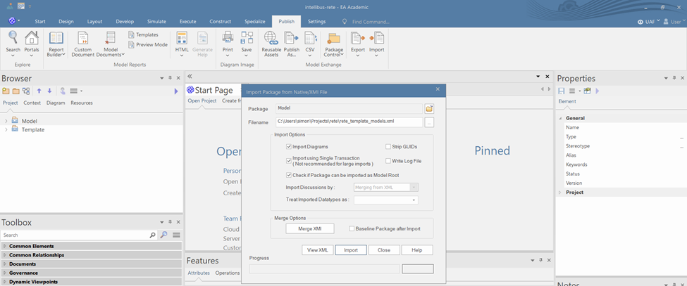
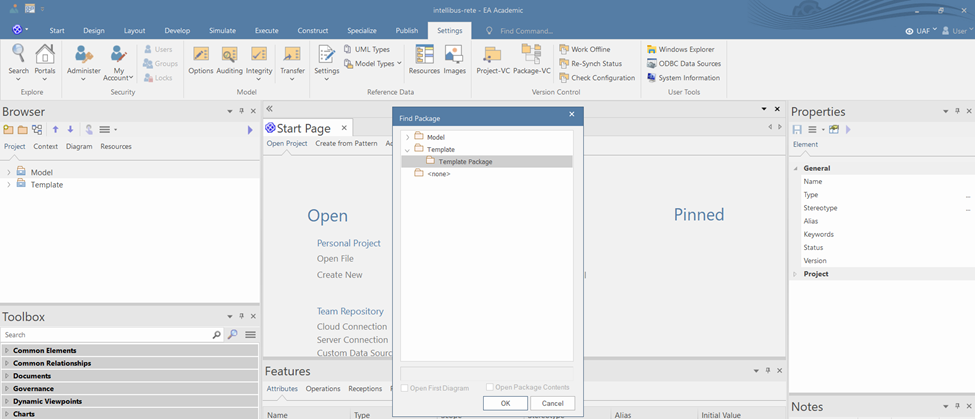
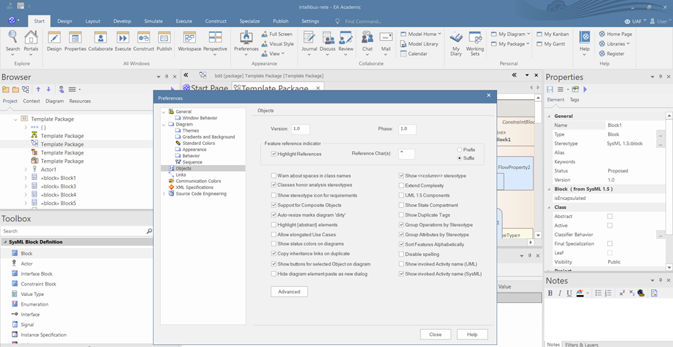
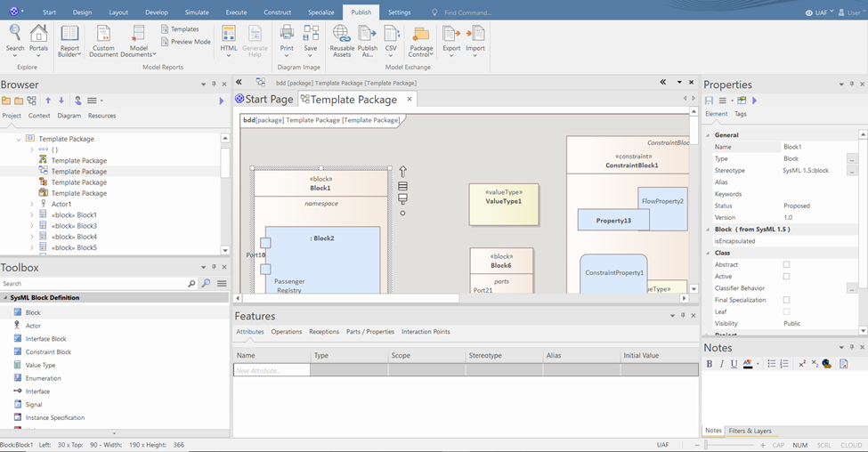
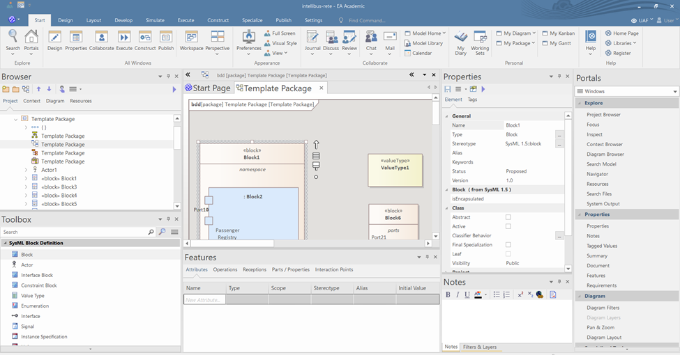
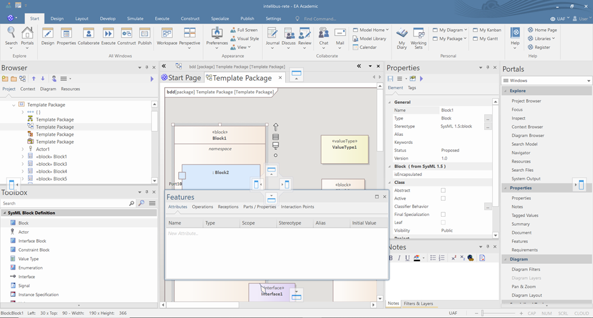
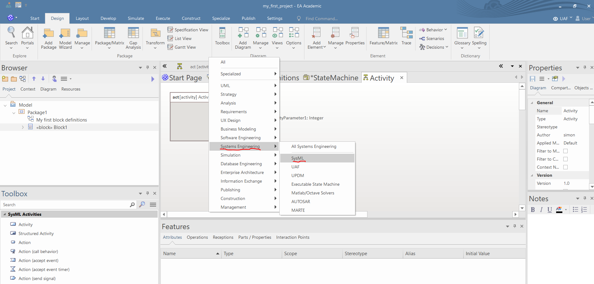
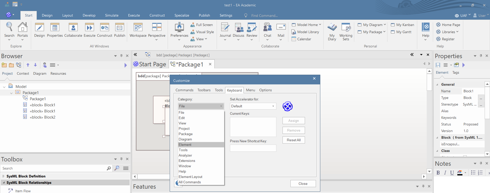

# Előzetes lépések

## Template package beállítása
OK: A SysML diagrammokon alapértelmezetten minden compartment engedélyezve van. Ez azért egy hatalmas probléma mert ha készítesz egy tökéletes diagrammot és később a diagrammokon lévő elemeknek új property-jei lesznek akkor azok alapértelmezetten megjelennek a compartment-ben és az összes elem átméreteződik. A compartment-eket csak egy speciálisan elkészített tamplate package-dzsel lehet megakadályozni, amit előre kidolgoztam.

1.	A Publish fülön válaszd ki az Import-nél az alábbi linkről letőltött XMI File…-t (link).

2.	A felugró ablakban válaszd ki a kiexportált template package-ta Filename mezőben és nyomd meg az import-ot. Az import során felugrik egy ablak ahol Yes-t kell választani.
 
3.	A Settings fülön, válaszd ki a Project Template Package menüpontot.
 
4.	Válaszd ki a beimportált template package-t és nyomd meg az OK-t.
 
5.	Start fülön a Preferences menüpontban az Other preferences-nél a felugró ablakban állítsd be a Auto-resize marks diagram ’dirty’-t ugyanis ezzel a lépéssel az autoresize CTRL-Z-vel (nem minden esetben, de) visszaállítható

## Ablakok beállítása
A programozói környezetekhez hasonlóan itt is sok féle ablak van, ahol mindenféle beállítást találtokaz alábbi öt ablak a legfontosabb:
 * **Browser**: itt lehet a modell struktúrájában navigálni
 * **Toolbox**: az éppen szerkesztett diagrammhoz való paletta
 * **Features**: az éppen kiválasztott modell elem által tartalmazott más modell elemek összefoglaló ablakja
 * **Notes**: az éppen kiválasztott modell elemhez note-ot lehet vele tenni
 * **Properties**: az éppen kiválasztott modell elem alapvető tulajdonságait tudjuk beállítani, itt sokszor az elem típusától függően több tab is van, a tab-ok között sokszor véletlenszerűen vannak szétszórva a beállítások ezért érdemes mindegyiket megnézni

Ablakok beállításának lépései:
1.	A Start fülön a Portals menüpontban ki kell választani a Windows-t 

2.	A felugró ablakban ki kell választani a azokat az ablakokat amiket szeretnénk használni (érdemes kísérletezni).

3.	Az ablakokat a tetejüknél fogva mozgassuk a nekünk tetsző helyre.

4.	A Portals ablakot tüntessük el úgy, hogy a tetején jobb klikkelünk és a hide-t választjuk.

## Nézet beállítása

A különböző nézetek segítségével a létrehozandó elemek és diagrammok típusainak körét le tudjuk szűkíteni attól függően, hogy milyen modellezési feladatot kell elvégeznünk. Ennek motivációja, hogy az EA-ban nagyon sok féle UML alapú modellezési nyelv érhető el és ha például rendszer modellezést akarunk csinálni akkor tipikusan SysML-t akarunk használni nem pedig BPML-t vagy UML-t.

1. Kattints a menü ikonra a toolbox jobb felső sarkában és válaszd ki a Change Perspective-t.

2. Ezután válaszd ki a Systems Engineering menüpontban a SysML-t.

 
# Használati tippek

## Hasznos shortcut-ok

Az EA hatékony használatához elengedhetetlen a legfontosabb gyorsbillentyűk ismerete. A legfontosabb gyorsbillentyűk használatával jelentősen gyorsíthatjuk a modellezés folyamatát. A legfontosabb gyorsbillentyűk az alábbiak:

 * *Del*: törlés és választás vizuális és valódi törlés között, ha vizuális a törlés, csak a diagrammon lesz változás, a mögöttes modellelem megmarad
 * *CTRL+Del*: valódi törlés, nem csak a diagrammon lesz változás, a mögöttes modellelem is törlődik
 * *CTRL+C* és *SHIFT+Insert*: vizuális copy-paste, csak a diagrammon lesz változás, a mögöttes modellelem változatlan
 * *CTRL+C* és *CTRL+SHIFT+V*: valódi copy-paste, nem csak a diagrammon lesz változás, a mögöttes modellelem is megváltozik
 * *CTRL+N*: új elem/diagram létrehozása
 * *CTRL+M*: új model elem hozzáadása a kiválasztott package-hez
 * *CTRL+SHIFT+Y*: kiválasztott modell elemen a compartment-ek megjelenésének engedélyeztetése
 * *CTRL+Z*: Vizuális undo (sajnos valódi undo nincs EA-ban) 
 * *AltGr*: A kiválasztott elemhez ugrik a Browser-ben 
 * *AltGr+G*: A kiválasztott porty/port/attributy típusához ugrik a model explorer-ben 
 * *F2*: kiválasztott modell elem átnevezése
 * *F3*: a legutoljára létrehozott kapcsolat típusából lerakni még egyet (például ha utoljára generalization kapcsolatot tettél egy BDD-ra akkor ezzel a paranccsal mé egy generalization-t tudsz bekötni)
 * *SHIFT+F3*: a legutoljára létrehozott elem típusából lerakni még egyet (például ha utoljára block-ot tettél egy BDD-ra akkor ezzel a paranccsal mé egy block-ot tudsz lerakni)

## Shortcut-ok beállítása

1. A Start fülön a Preferences menüpontban kattints az Other Options-ra 

2. A felugró ablakban menj rá a Keyboard menüpontra és kategóriánként megnézheted, hogy milyen parancsokat lehet gyorsbillentyűvel elérni.

3. A Press New Shortcut Key mezőbekattintva a kívánt kombinációt lenyomva, majd az Assign gombra rákattintva lehet új billentyű kombinációra átteni a parancsot.

## Tippek a diagram rajzolásához

 * Minden elem a diagrammon jelen nagyjából kétszer akkora, mint minimálisan szükséges. A túl kicsi modell elemeket az EA automatikusan átméretezi. Főleg a kicsi magasság a kritikus.
 * Érdemes először BDD diagrammot készíteni és azokon előre mindent specifikálni amire később szükség lehet. 
 * A diagrammokat MINDIG úgy kell létre hozni, hogy a Browser-ben a tartalmazó modell elem fölé húzod az egeret és vagy
     -  jobb klikk és a „New diagram” kiválasztása
     -  CTRL+N és a „New diagram” kiválasztása
 * NE helyezz BDD-re osztályt mert a diagram layout teljesen felborul
 * Ha egy elemet behúzol a Browser-ből a diagrammra akkor felugrik egy ablak, hogy Link/Property/Instance/Port/stb… formájában szeretnéd-e betenni a diagrammra. Ez nagyon kényelmes és gyors módja a property-k, port-ok,… létrehozásának.
 * Ha valamilyen modell elemet mozgatsz és lenyomod a CTRL-t akkor azt a modell elemet modell szerint lemásolja
 * A Layout fülön a "Diagram Layout/Auto Route" parancs elég jól beállítja a relációk *vonalvezetését ésrouting-ját* adiagrammokon.
 * Ha kijelölsz egy relációt akkor jobb klikk "Line Style" menüpontban tudod beállítani, hogy egyenes, szögletes vagy cikk-cakkos vonalvezetési stílust szeretnél. Ha jobb klikk után az "Apply Line Style on Diagram"-t választod akkor a diarammon az összes azonos típusú reláció stílusát be tudod állítaniegyszerre.

