# Prerequisites

The following steps must be executed before this exercise:

  - Install EA 17.1

  - Run EA 

  - Open the tutorial model available here: [MODEL_LINK](https://github.com/ftsrg-rete/remo-lecture-notes/raw/refs/heads/master/docs/assets/remo-tutorial-models-2.qeax)

  - Set the perspective (in the top right corner) to "SysML"
 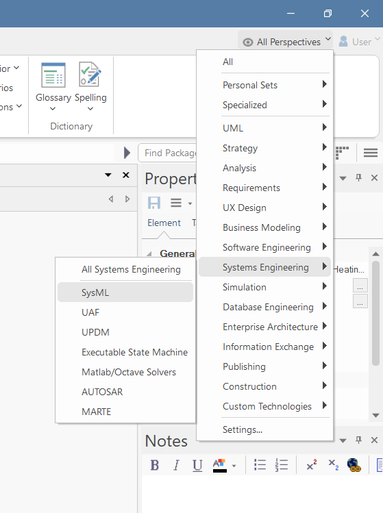

  - In the "Settings" menu, open "Options", and then in the "General" tab, select the "Dashed line for control flow" option:
  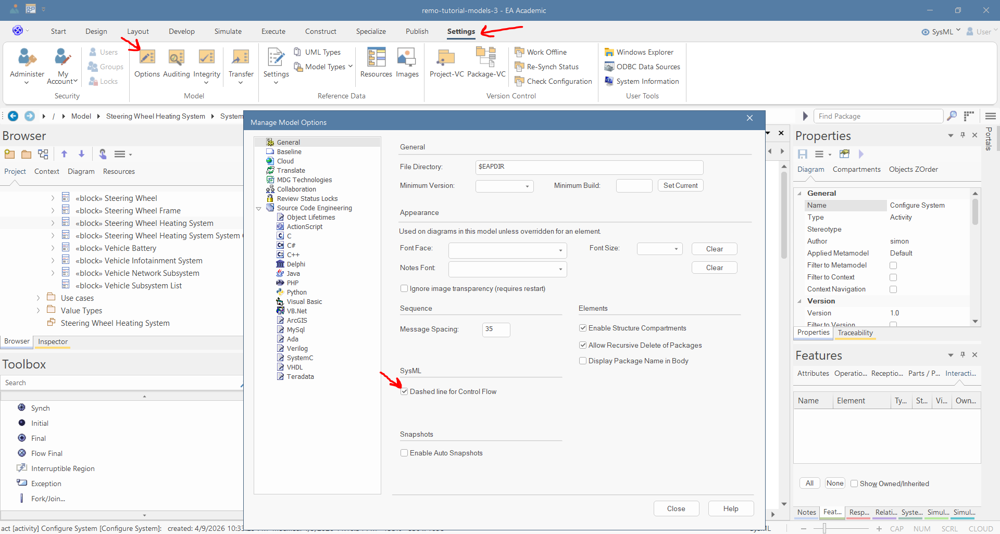

  - Make sure that the following windows are open:

    - Explore/Model Browser

    - Explore/Inspect

    - Explore/Focus

    - Properties/Properties

    - Properties/Notes

    - Properties/Tagged Values

    - Properties/Features

    - Properties/Requirements

    - Trace/Traceability

    - Trace/Relationships

  - If some windows are not visible, then click on "Portals/Windows" and click on the window names (after that, right-click on the windows and select auto-hide):
  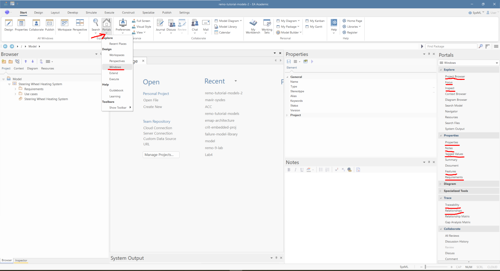

  - Make sure that the toolbox is visible:
  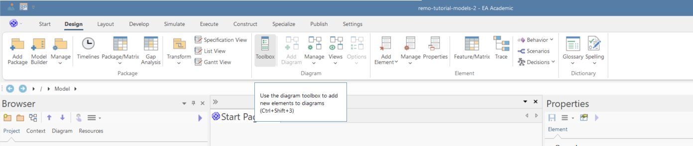

  - Arrange the windows by dragging them into a position where you can intuitively find them:
  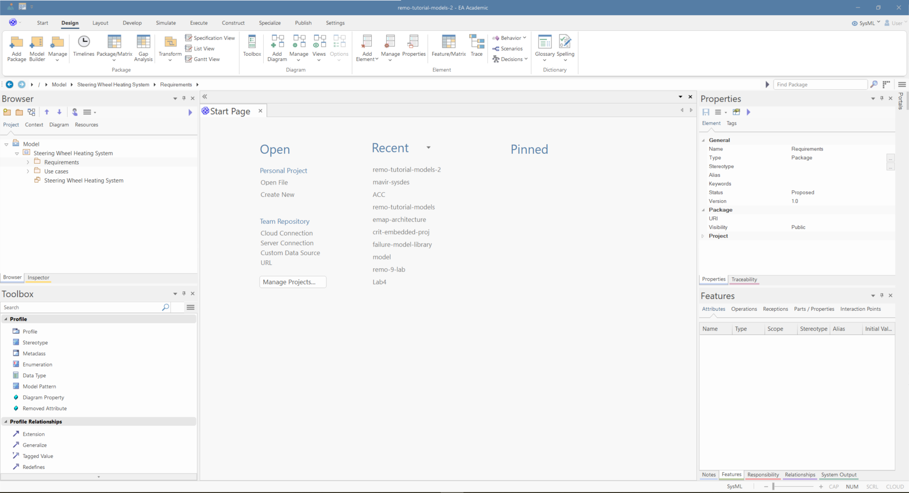

# Interaction Modeling

Interactions are behavioral models that define the communication of two or more components using sequence diagrams. This tutorial shows how you can define the interaction at the system boundary.

  - Right click on the "*Steering Wheel Heating System System Context*" and select "Add/Interaction/with Sequence Diagram":
  

  - Name it "Configuration Interaction" and click "OK":
  

  - Drag and drop the "system" and "infotainment" part properties into the diagram as **links**, then press OK.
  

  - Arrange the properties in the following way:
  

  - Use the Message relation in the "SysML Interaction Relationships" toolbox page to create two Messages between the infotainment and system parts (in both directions):
  

  - Select the first message and in the Properties window select the "configure" operation:
  

  - Delete the return value of the first message, then select the second message, and in the properties window, set the return value to "ConfigurationStatus.Successful". Thereafter, select the "Is Return" option:
  

  - Right-click the second message and select "Timing details"
  
  
  - Set the "Duration between messages" to "< 10 ms"
  

  - Move the constraint into the correct position:
  

  - Drop a fragment into the diagram:
  

  - Select the fragment. In the "Combined Fragment" tab of the Properties window, set the type to "alt", set the name to "ConfigurationCheck", and press "Save" (pressing "New" in the Interaction Operands before pressing Save can reset the name). Add a new condition "(maxHeatingPower > 0.0 W) and (defaultTemperature < 35°C)", and press "Save". Thereafter, create another condition by pressing "New" and set the condition to "else", and press "Save" (the new condition will appear in the list only after clicking "Save", not instantly after "New"; "New" basically makes sure that no condition is selected, but the actual addition is done by saving):
  

  - Arrange the modeling elements in the way shown in the picture below. *Tips for arranging messages in a sequence diagram*:
    - By default, moving a *message* up and down also moves the elements below it to keep the ordering, but holding shift or alt while enables moving it freely
    - Holding shift or alt is also needed to move a message into a fragment
    - Moving *fragments* behaves differently: moving freely is the default, and to change this, instead of holding shift/alt, you need to toggle the "Move Freely" mode on/off, which is the last icon to the right of a selected fragment.
    - Changing the source/target of a message by dragging the ends can be difficult as EA often starts moving the lifeline instead of the message end. Use right-click/Advanced/Set Source and Target instead.
  

  - Create another return message in the following way:
  

  - Create another interaction with a sequence diagram in the system context called "Main Operation":
  

  - Drop the system and the infotainment parts into the diagram as links and create two messages the following way:
  

  - Select the messages and in the properties window set the Kind to "Signal" and Sync to "Asynchronous":
  

  - In the Message field of the properties window, select the signals "Start" and "Stop" (from the "Interfaces" package) for the two messages:
  

  - Right-click on the first message and select "Activations/End source activation":
  

  - Drop the "Configuration Interaction" into the diagram as **Link**:
  
    
  - Use the "SysML Interactions" toolbox page to add two "State/Continuation" to the diagram, in the following way:
  
  - Add a "loop" fragment and another signal message to the diagram, in the following way (don't forget to select "Activations/End source activation"):
  

  - Right-click on the new message and select "Attach note or constraint":
  

  - Right-click on the new message and select "Timing details". In the pop-up window, set the "Duration Constraint" to "< 100 us":
  

# Activity Modeling

This section shows you how you can create activity diagrams. In this tutorial, we will create activities for the "Steering Wheel Heating System".

  - Right-click on the "Steering Wheel Heating System" and select "Add/New Diagram":
  

  - In the pop-up window, select Activity and click on "Create Diagram". We will use this diagram to define the main activities of the system. 
  

  - **Visually** delete the ports in the diagram (SHIFT+Del).

  - Use the "SysML Activities" toolbox page to create five Structured Activities (in the pop-up window select other and in the other pop-up window select "Simple Compos..."), namely, "Configure System", "Set Reference Temperature", "Activate Heating", "Deactivate Heating", and "Safe Reference Setting".
  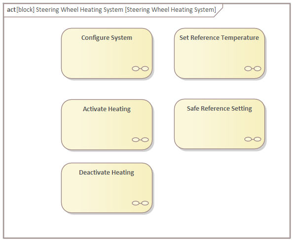

  - Open the diagram of the "Safe Reference Setting" and use the "SysML Activities" toolbox page to create two parameters (if EA doesn't let you create them directly on the left side of the border, create them on other parts of the border and move them):
  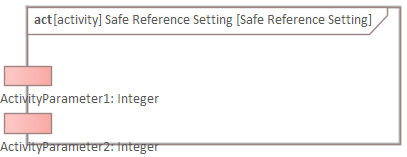 

  - Select the properties, and in the "Element" tab of the properties window, name the parameters to "tempRef" and "isInRange".
  
  - In the "Parameter" tab of the properties window, set the type and direction of the parameters. refTemp is an input, and its type is Temperature (from the "SysPhs Library\Value Types and Units" package). isInRange is an output, and its type is Boolean.
  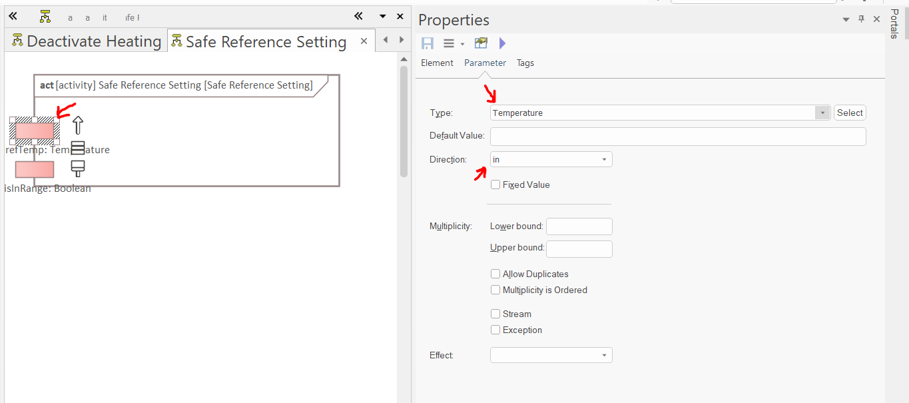

  - Create a "Decision" node and connect it to the refTemp input parameter with an object flow:
  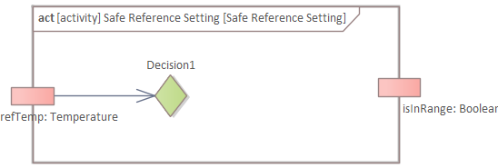

  - Create Actions using the "SysML Activities" toolbox page. In the pop-up window, select "Atomic":
  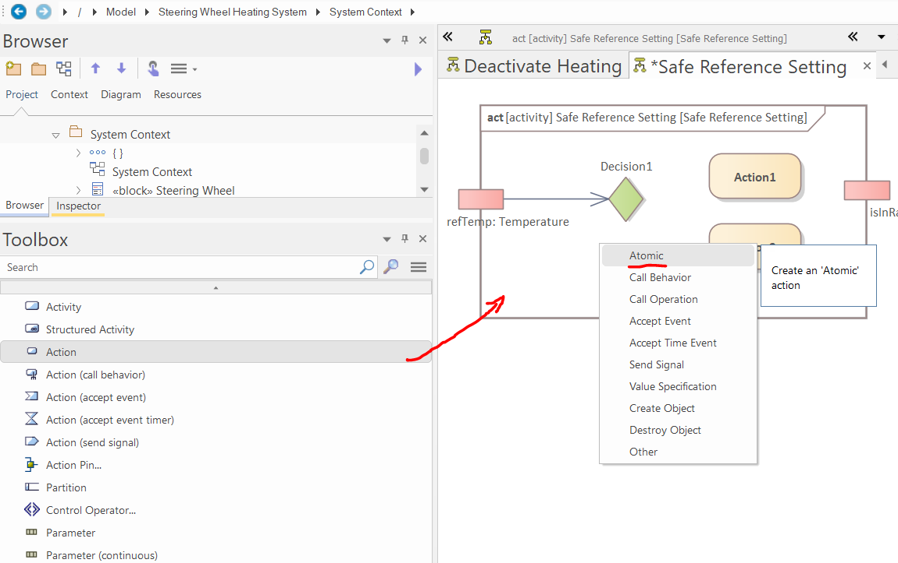

  - Create two action pins (with no stereotype) for each of the two atomic actions:
  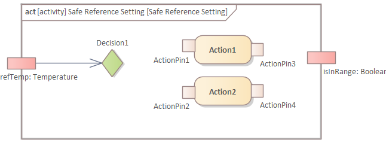

  - Similarly to the parameters, set the direction, type, and name of the action pins:
  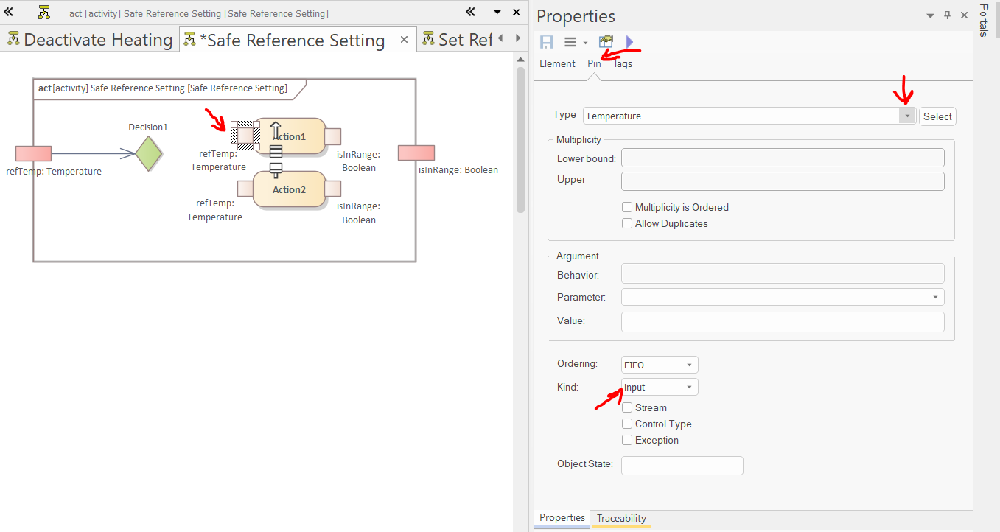

  - Create a merge node and connect the elements with object flow:
  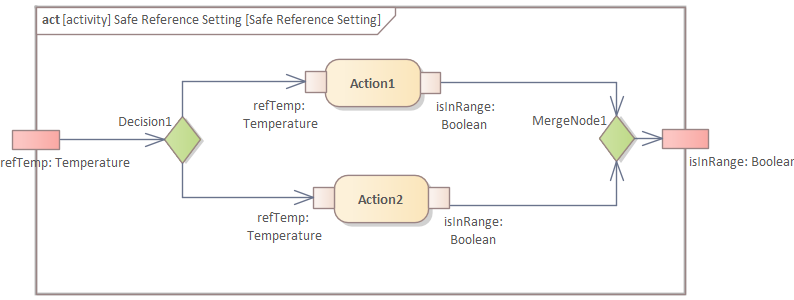

  - Define the guard of the incoming flow of "Action 1" in the "Constraints" tab of the "Properties" window:
  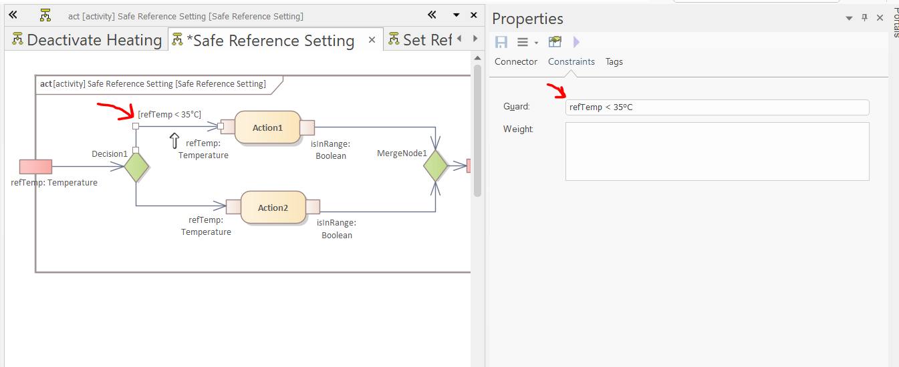

  - Select the atomic actions, and in the "Action" tab of the properties window, define the effect of the actions. Thereafter, select the "Show Effect in Diagram" option.
  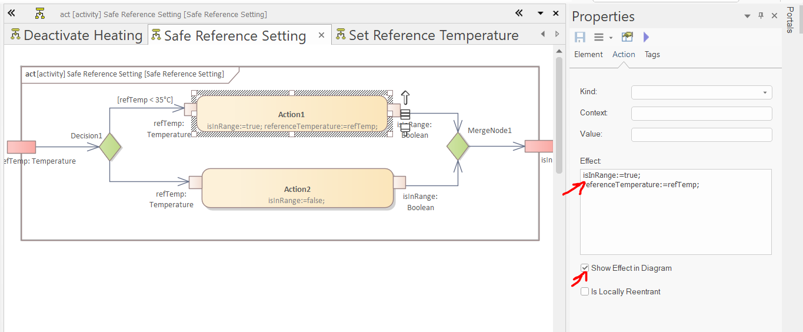 

 - Open the diagram of the "Configure System" activity and create an Activity Initial and a (vertical) Fork node:
 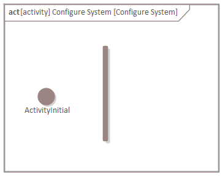

 - Drag and drop the "Set Reference Temperature" Activity to the diagram and drop it as "Invocation Action":
 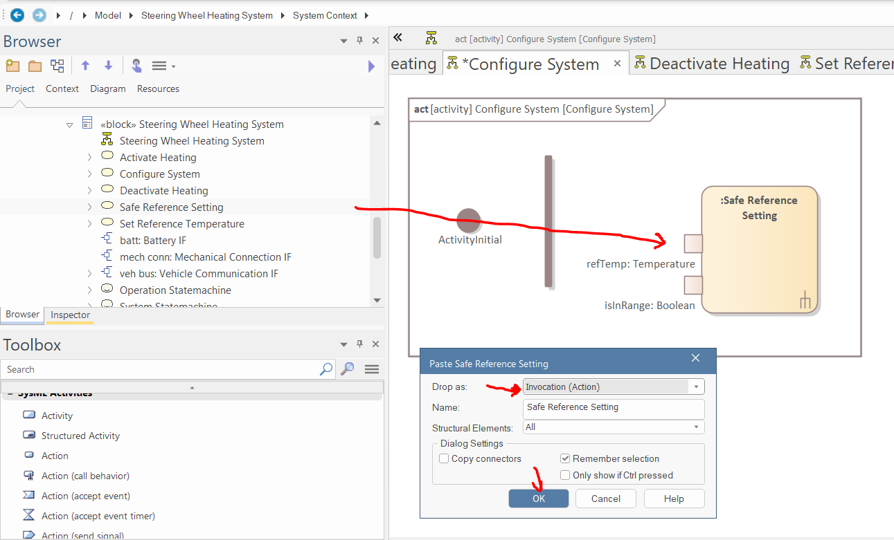

 - Create seven atomic actions with action pins (*Tip*: to speed this up, you can use Ctrl+Click on blank parts of the diagram to create a new element of the same type as the last; unfortunately, this does not work for the pins):
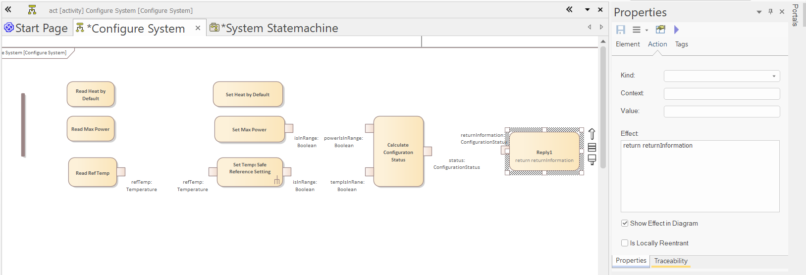

 - Create two object nodes and set their name and classifier in the properties window:
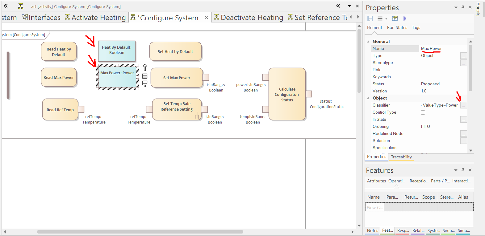

- Create a (vertical) "Fork/Join" and a flow final activity node:
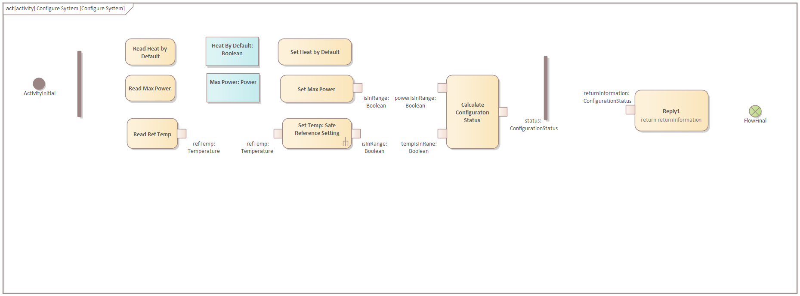

- Create control and object flows:
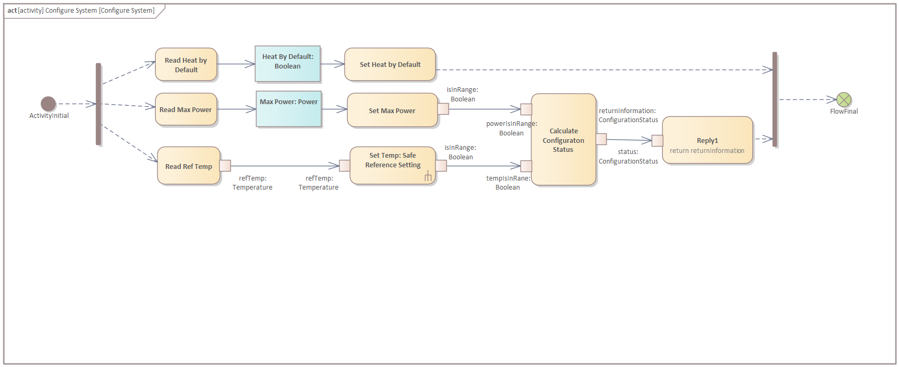

- Create an "Interruptible Region" around the actions (*Tip:* moving an interruptible activity region moves everything in it with it; holding alt enables moving it freely instead):
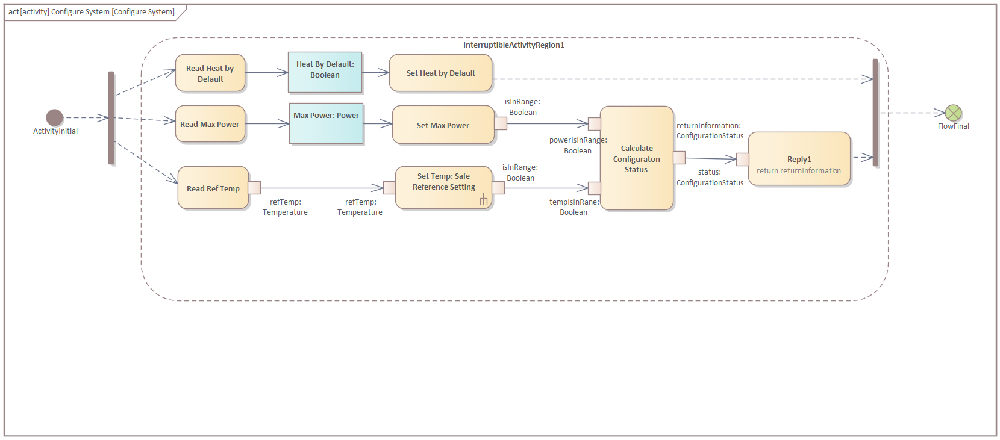
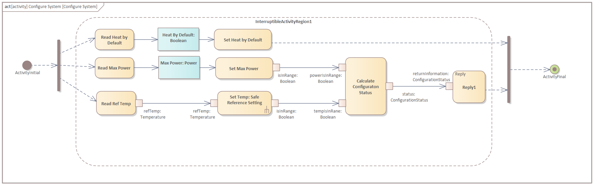

- Create a copy of the Reply1 action (CTRL+Drag is the fastest way, but make sure to select the pin as well) and create an Accept Timer Action and a Final activity node.Select the Accept Timer action and in the Trigger tab of the properties window create a new Time trigger with the following specification: "after 10 us".
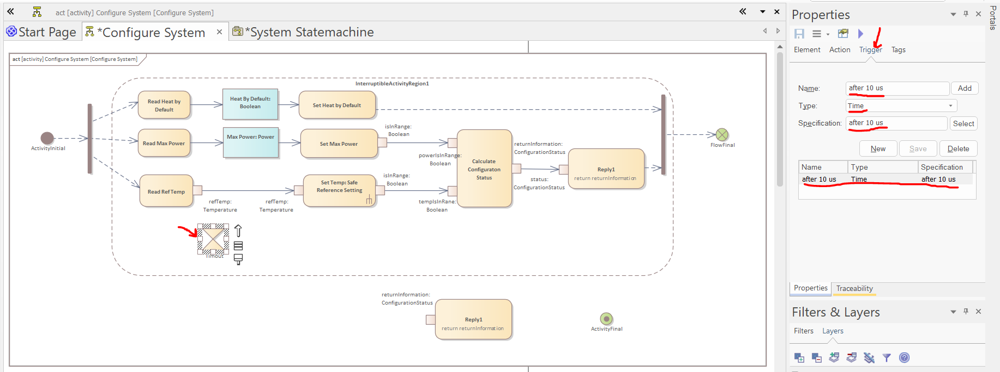

- Create a "Value Specification" action:
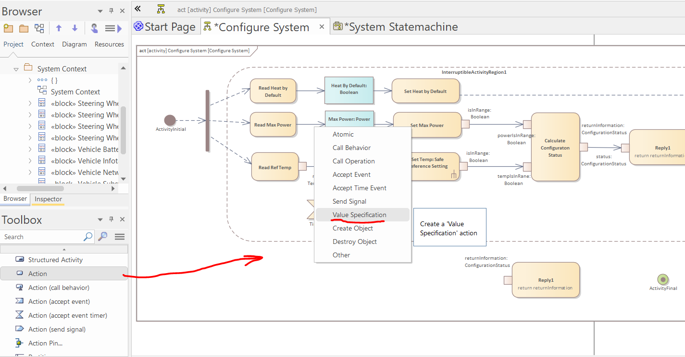

- Select the value specification and in the Properties window set the value to "ConfigurationStatus.Error" and in the "Interaction Point" tab of the Features window visualize its action pin and set its type to "ConfigurationStatus".
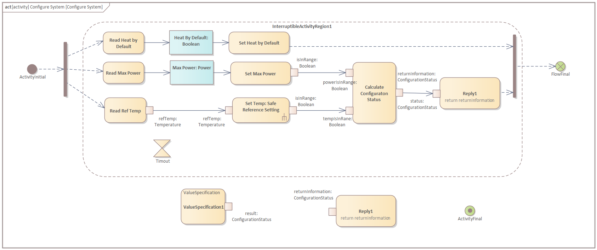

- Connect the Accept Event Action to the value specification with an "Interrupt Flow":

- Add an object and a control flow and finish the diagram:
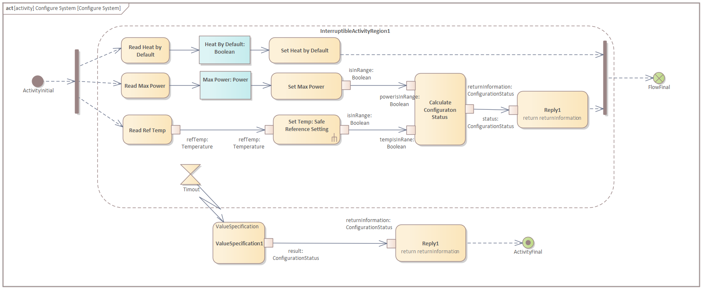

# Statemachine Modeling

In this section, we will create the statemachine of the "Steering Wheel Heating System".

- Right click on the "Steering Wheel Heating System" and select "Add/Statemachine", name the statemachine to "System Statemachine" and click OK:

- Select the "Steering Wheel Heating System" block, and set "System Statemachine" as its Classifier Behavior in the Properties window.

- Use the "SysML State" toolbox page to create an initial state and three states, namely, "Off" and "On": 

- Use the "SysML State Relationships" toolbox page to create two transitions between the states:

- Select the second transition (between On and Off states), and in the "Constraints" tab of the Properties window, set the guard to "batt.V_BAT.v > 10 V":

- Thereafter, in the Triggers section of the "Constraints" tab of the Properties window, create a new trigger (just like before in the case of Combined Fragment conditions, the "New" button does not add a new trigger to the list yet; it appears after pressing "Save"):
  - Name: "start"
  - Type: "Signal"
  - Specification: "Start" (click the "SET" button near the specification field and select the "*Start*" signal)

- After the configuration, click save:

- Select the "On" state and in the "Regions" tab of the Properties window, create a region by writing "main" in the name field and clicking "Add" (this way, you can define any number of orthogonal regions):

- In the internal region of the On state, create some states and transitions :

- Create a new call trigger by selecting the "configure" operation of the "ConfigurationInterface":

- Select the effect is a behavior checkbox, and select the "Configure System" activity (created in the previous part of this tutorial as an activity of the Steering Wheel Heating System) as an effect:

- Within the browser, you can select the triggers. Thereafter, in the Trigger tab of the properties window, set the "Port" to the "veh bus" port of the Steering Wheel Heating System:

- Select the "Operational" state and in the properties window select the "Submachine" behavior of the state. Thereafter, in the pop-up window, select the system and click "Add New". Set the name to "Operation Statemachine" and the Type to "State Machine", and click "Save":

- Move the new statemachine under the system in the project browser. Select the "Operational" state and in the Regions tab of the properties window set the "*Instance Classifier*" to the "Operational Statemachine".

- Open the statemachine diagram of the "Operational Statemachine" and create the following states and transitions:

- Create the "tooHot" and "tooCold" change triggers with "when(referenceTemperature < temperature)" and "when(referenceTemperature > temperature)" specification respectively.

- Select the "Heating" state and in the properties window set the entry and exit action to "Activate Heating" and "Deactivate Heating" activities, respectively:

- In the browser, right-click the "Operational Statemachine" and select "Add/Entry Point":

- Create two entry points and one exit point in this way, and drop them from the browser to the diagram:

- Connect the entry and exit points to the states using transitions and add a time trigger to the transition, in the following way:
 

- Open the "System Statemachine". Select the "Operational" state. Right-click in the "Connection Points" tab of the Features window and select "Add New". In the pop-up window, select the "Heating" entry point, name the reference to "Heating", and click "OK".

- Repeat this process for the other entry and the exit points.

- Create a "Choice" pseudostate and a normal state the following way:

- Add transitions and modify the existing incoming transition of the Operational state the following way:

- Define the guard of the outgoing transitions of the "Choice" pseudostate the following way:

- Select "Operational" state and in the "Internal Trigger" tab of the Features window, right-click and select "New Internal Trigger..."

- Select the new internal trigger in the Features window and in the properties window specify the trigger and its effect as if it was normal transition:

- Create a transition from the On state to the Off state, and add two triggers to this tranition the following way:
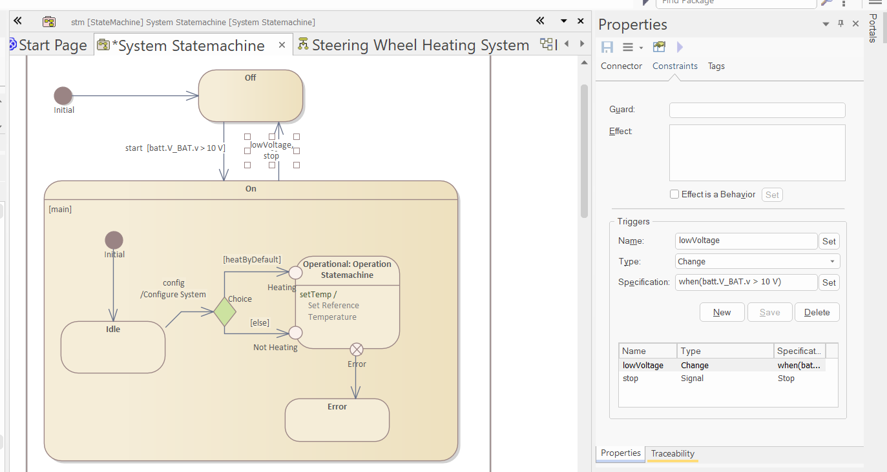

- Finally, in the browser, select the triggers and in the "Trigger" tab of the properties window, add the "veh com" port of the system to the trigger:
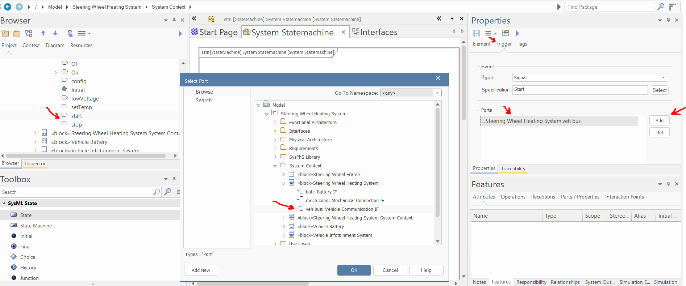

