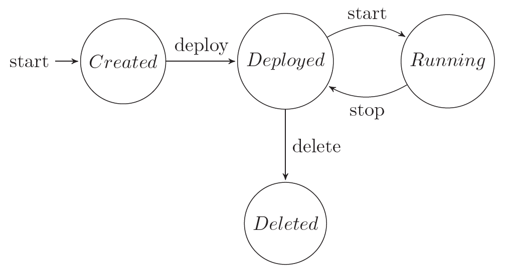

This laboratory exercise will illustrate test design techniques. The tasks can be solved on paper or in Excel.

# Specification-based test design

## Age discount

Our marketing department launched a campaign for our long-time customers in our online liquor store. Customers older than 20 years receive a 2% discount, those older than 30 years receive a 3% discount, while those older than 50 years receive a 5% discount on their purchase. All they have to do is select a liquor on a special form, enter the requested quantity and their birth date, and they will benefit from the special promotional price.

The developers were in a hurry, but finished the implementation. They also tried it with the following test data: selecting two bottles from a €100 whiskey and entering 1950-01-01 as birth date. They received €190 as the final price, thus they are confident that the implementation works correctly.

1. Point out important parts of the specification that they missed when testing (try to create equivalence partitions or define boundary values for the parameters)!
2. Design test cases (input values, expected outcome) for the above specification!

## Flight price calculation

We are testing a module that calculates the prices of extras for a flight ticket. A 15 kg baggage costs €10, the 20 kg baggage €20. A customer can buy at most two pieces of baggage. A €15 excess fee is added if the baggage is purchased at the airport. Seats can be reserved for an extra price of €8. Priority seats (rows 1-3) cost €13. Customers can buy a "leisure" pack for €15, which includes 15 kg of baggage and a reserved seat.

1. Design test cases (input values, expected outcome) for the above specification!

# Model-based testing

We are testing a cloud controller system that can manage the lifecycle of virtual machines. When a VM is created, its disk is allocated on shared storage. When the VM is deployed, its disk and configuration files are copied to a virtualization host. A deployed VM can be started, and a running VM can be stopped. If the VM is not needed anymore, it can be deleted. To help the test design a member of the team has created the following finite state machine, which represent the lifecycle of a virtual machine. 

1. Is the state machine correct with respect to the specification?
2. Is the state machine complete? (Note: For FSMs, completeness means that in every state for every event, the behavior is specified.)
3. Select a set of test input sequences that provide 100% state coverage!
4. Select a set of test input sequences that provide 100% transition coverage!
