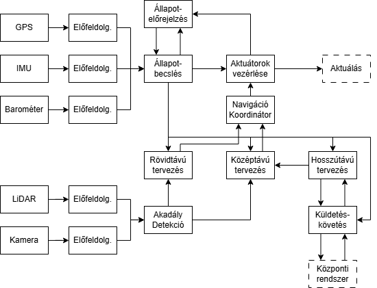
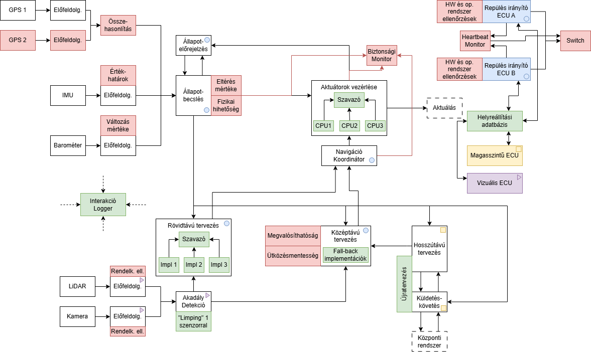

## Várható idő metrikák

Adott egy komponens λ=0.0001 1/h hibarátával és μ=1/48 1/h javítási rátával. Számolja a ki a komponens MTTF, MTTR, MTBF metrikáit és aszimptotikus rendelkezésre állását! 

## Hibatűrés architekturális mintáinak vizsgálata

Cégünk autonóm drónokat tervez városi csomagszállítási céllal. Minden drónnak képesnek kell lennie a követekezőkre:
- A fedélzeti érzékelők és tervezőprogram segítségével el kell jutnia a szállítási célállomásokra.
- A drónokat koordináló központi rendszertől kell tudnia küldetéseket fogadni, és az útvonaltervet egyeztetni.
- A küldetés előrehaladtát rendszeresen jelentenie kell a központi rendszer felé.

Korábban már elkészült a drón mozgás funkciójáért felelős részrendszer architektúrája. A funkcionális architektúrát hibadetektálási és hibatűrési mechanizmusok nélkül az alábbi sematikus ábra mutatja:

A drón a helyzetének meghatározásához egy IMU-t, egy barométert és egy GPS-t használ. Mindegyik szenzor kimenete átesik egy előfeldolgozási lépésen, amelynek célja zajszűrés, a kalibráció figyelembevétele, és megfelelő mértékegységre konvertálás. Ezek mellett működik egy állapotelőrejelző komponens, amely a legutóbbi becsült állapot és az aktuátoroknak adott vezérlőjelek alapján előrejelzi a következő állapotot a drón mechanikájának matematikai modelljét felhasználva. A legutóbbi ciklusban előrejelzett állapot és az előfeldolgozott mérési adatok egy Kalman-szűrőn alapuló állapotbecslő komponensbe jutnak, amelynek eredményét – azaz a becsült jelenlegi állapotot (fizikai pozíció) – több komponens felé is továbbítjuk. Megkapja a már említett állapotelőrejelző komponens, az aktuátorok vezérléséért felelős komponens, és a tervezésért felelős komponensek. A drón által bejárandó trajektóriát három szinten tervezzük: 
- Egy hosszútávú tervező komponens az új küldetés megkapásakor meghatároz egy útvonalat a célig, amelyet egyeztet a központi rendszerrel (ahol megtörténik az útvonal légi biztonsági validációja is). Ezen komponens követi az útvonaltervvel való haladást, és adott időnként jelzi azt a küldetéskövetésért felelő komponensnek, amely kommunikál a központi rendszerrel.
- Egy középtávú tervező komponens a lokális trajektória megtervezéséért felelős, amely az előre felismert akadályok körüli manővereket tervezi meg, és finomítja a magasszintű útvonal jelenleg releváns szakaszát egy megvalósítható trajektóriára.
- Egy rövidtávú tervező komponens felelős a hirtelen elénk kerülő akadályok elkerüléséért, a megtervezett középtávú trajektóriát felülírva vészhelyzeti manőverekkel.

A közép- és rövidtávú tervező komponensek egy navigáció koordinátor komponensnek küldik a jelenleg szerintük elérendő pozíciót. A navigáció koordinátor elsődlegesen egy arbitrátor feladatot lát el: amennyiben a rövidtávú tervező szerint szükség van hirtelen elkerülő manőverre, akkor azt a jelet küldi tovább, amennyiben nincs, akkor a középtávú tervezőét. Az aktuátoroknak küldendő vezérlőjel számításáért felelős komponens a koordinátor kimenetét kapja meg, így annak egyetlen jelet kell csak kezelnie ahelyett, hogy mindkét tervezővel való kommunikációért is felelős lenne. Annak érdekében, hogy a vészhelyzeti manővereket a szabályzó algoritmus más módon kezelhesse (pl. kevésbé stabil vagy hosszú távon nem fenntartható aktuálást igénylő, de a hirtelen manővereket időben elvégezni képes szabályzásra váltás), a koordinátor a referenciajel mellé egy flag-et is csatol, mely mutatja, hogy nominális vagy vészhelyzeti mód szükséges. Mind a rövid, mind a középtávú tervezőnek szüksége van információra a közelben található akadályokról. Ezeket egy LiDAR és egy kamera segítségével detektáljuk, melyek jelei szintén átmennek egy előfeldolgozáson. Mivel a rövidtávú tervezésnek rövid idő alatt értesülnie kell a hirtelen előkerülő akadályokról, ezen funkció időkritikus.

Cégünk rendszertervező csapatának hibatűrésért felelős tagjai elkészítettek egy előzetes tervet a hibadetekciós és hibatűrési mechanizmusokról – alább látható az architektúra ezekkel bővített sematikus ábrája.

A terv szerint az IMU és a Barométer előfeldolgozásához különböző numerikus ellenőrzéseket csatolunk a mért értékekről, GPS vevőből pedig kettő szerelünk be a drónba, és az értéküket összehasonlítva értesülhetünk róla, ha valamelyik elromlott. Bár nem ideális, de egy ideig (pl. biztonságos hely megtalálásáig) az egyik mozgásszenzor kiesése mellett is tud a drón navigálni. Ehhez hasonlóan az akadályokat detektáló szenzorokhoz is csatolunk ellenőrzést, de itt a jelek bonyolultsága (kép és pontfelhő) miatt csak alapvető rendelkezésre állási ellenőrzést végzünk, pl. nem teljesen fekete-e a kép. Ez alapján az akadály detektor komponens ideiglenesen „limping” módba tud kapcsolni, ahol csak az egyik szenzorra támaszkodik, amíg a drón talál egy biztonságos helyet a leszálláshoz.

Az állapotbecslő komponens az állapotbecslés elvégzését követően ellenőrzi az állapot fizikai hihetőségét (figyelembe véve a korábbi állapotot), emellett akkor is hibát jelez, ha egy előre meghatározott értéknél nagyobb az eltérés az előrejelzett és a mért állapot között.

Az aktuátoroknak küldött vezérlőjelet egy különálló komponens monitorozza, és azokon ellenőrzést végez, például nominális módban elvárjuk, hogy ne kezdjen instabil, hirtelen mozgásokba a drón, vagy ellenőrizzük, hogy ne terheljük túl a motorokat hosszú távon. A vezérlőjelet számító szabályzó algoritmust egy dedikált ECU-ban 3 független CPU számolja párhuzamosan, és az általuk számított jeleket egy „szavazó” komponens hasonlítja össze. Mivel a futtatott algoritmus azonos, és azonos bemeneteket használnak, ezért helyes működés esetén mindegyik ugyanazt a numerikus eredményt adja, így a szavazásnál nem számolunk tolerálható eltéréssel.

A rövidtávú tervezésnél 3 különböző algoritmikus alapelven működő implementációt készítünk, és az eredményükön szavazást végzünk a kitérő manőver szükségességéről és irányáról.

A középtávú tervezéshez bevezetünk explicit ellenőrzéseket a megtervezett trajektória megvalósíthatóságáról és az ütközésmentességről. Több implementációt is készítünk a középtávú manőverek megtervezéséhez: gyors heurisztikus módszerekkel indítunk, de ezek nem biztos, hogy találnak megfelelő trajektóriát, amely esetben váltunk a költségesebb módszerekre.

A hosszú távú tervezés adatvesztés vagy a tervezett úttól nagy mértékű eltérés (pl. sok elkerülőmanőver miatt) esetén újratervez, a korábbi útvonalhoz visszatérés helyett a jelenlegi pozícióból tervez egy új, a központi rendszerrel egyeztetett utat. 

A mozgás megtervezéséhez kapcsolódó részfunkciók kódja (kék pöttyel jelölve) a repülés irányító ECU-n fut. Mivel ezen funkciók működése vészhelyzeti leszálláshoz is elengedhetetlen, ezen ECU-ból egy tartalékot is beépítünk. Mindkét példányon a gyártó által beépített HW ellenőrzések futnak induláskor és az alacsonyabb költségűek működés közben folyamatosan, emellett operációs rendszer szintű általános ellenőrzéseket is futtatunk – amennyiben ezen ellenőrzések hibát jeleznek, az ECU kikapcsol. A működő ECU-k folyamatosan életjelet küldenek egy heartbeat monitornak. A monitor jelzi egy tartalékra átállásért felelős komponensnek, ha az elsődleges ECU leállt. A rendszer tartalmaz egy helyreállítási adatbázist, melybe az elsődleges ECU rendszeresen menti az állapotát, így az átállás esetén átmozgatható a másodlagosba.

A hosszútávú tervezés és a küldetéskövetés egy magasszintű feladatokért felelős ECU-n fut, a GPU-t igénylő akadálydetekció pedig a vizuális feladatokért felelő ECU-n. Ezek is rendszeresen mentik az állapotukat, és adatvesztés esetén visszaállnak, amennyiben nem túl régi a legutóbbi mentés. Amennyiben már helytelen működést veszélye állna fenn a viszaállítással, a magasszintű ECU ehelyett újra egyezteti a küldetést a központi rendszerrel és újratervezi az útvonalat, a vizuális ECU pedig újrainicializál, elfelejtve az eddig felismert akadályokat.

Egy interakció logger komponens a drón buszhálózatán hallgatózik, és logol minden üzenetet a többi komponens között.

1. Hol alkalmazták az architektúra tervezői az egycsatornás architektúra beépített önellenőrzéssel mintát? Milyen alkalmazás-független önellenőrzéseket használunk? Milyen alkalmazás-specifikus önellenőrzéseket használunk?
2. Hol alkalmazták a kétcsatornás architektúra összehasonlítással mintát? Az alkalmazási példák közül melyikben szerepel diverzitás, és melyik egyszerű duplikáció?
3. Hol alkalmazták a kétcsatornás architektúra biztonsági ellenőrzéssel mintát?
4. Hasonlítsuk össze az előzőekben említett 3 minta előnyeit és hátrányait! Az egyes példák esetében használható lett-e volna egy másik minta a választott helyett? Ha igen, hogyan, és milyen előnyei/hátrányai lettek volna ennek a konkrét esetben? Tudnánk-e az egyes példák esetében akár kombinálni a mintákat?
5. Hol találunk példát ebben a tervben a hardware-hibák elleni hibatűrésre többszörözéssel? Mely esetekben látunk duplikálást diagnosztikával, és hol látunk tripla-moduláris redundanciát?
6. Amennyiben SIL 2-es mikrokontrollereket használunk egy 10-8 1/h hibarátájú szavazókomponenssel, mekkora a valószínűsége, hogy az aktuátorvezérlésért felelős részrendszer 10 év alatt működésképtelen lesz vagy helytelen vezérlőjelet ad (csak a hardware-t figyelembe véve, hibátlan szoftvert feltételezve)? Hogyan lehetne ezt tovább csökkenteni csak ugyanilyen hibarátájú alkatrészeket felhasználva?
7. Hol találunk példát tranziens hibák elleni hibatűrésre helyreállítással? Hogyan és milyen késleltetéssel tudjuk detektálni az adott hibát? Hogyan kezeljük a hibaterjedést? A helyreállítás melyik típusát (előre, vissza, kompenzáció) alkalmazzuk mely esetekben? Alkalmazható lenne másik típus?
8. Hol találunk példát szoftver hibák tűrésére? Melyik esetben használunk n-verziós programozást, és melyik esetben helyreállítási blokkokat? Alkalmas lenne-e az adott célra a másik minta is?

Opcionális feladatok:

9. A rendszertervező csapat egy tagja felvetette, hogy mivel úgyis van már a rendszerben egy kamera és egy LiDAR, ezeket is be lehetne csatornázni a mozgás érzékelésébe (vizuális odometria, optical flow). Milyen előnyei és hátrányai lennének ennek?
10. Mi történne, ha a vezérlőjel kiszámításához a bemenetekben is független lenne a 3 csatorna? Mi változna, ha a 3 CPU-n különböző szabályzókat akarnánk futtatni diverzitási céllal?
11. A korábban megadott adatokkal számolva mennyi a várható értéke annak az időnek, mire a 3. csatornából az egyik meghibásodik? Mekkora a várható értéke annak az időnek, mire 2 csatorna is hibás lesz?
12. Milyen egyéb hibatűrési mechanizmusokat lenne indokolt bevezetni a már feltüntetetteken kívül?