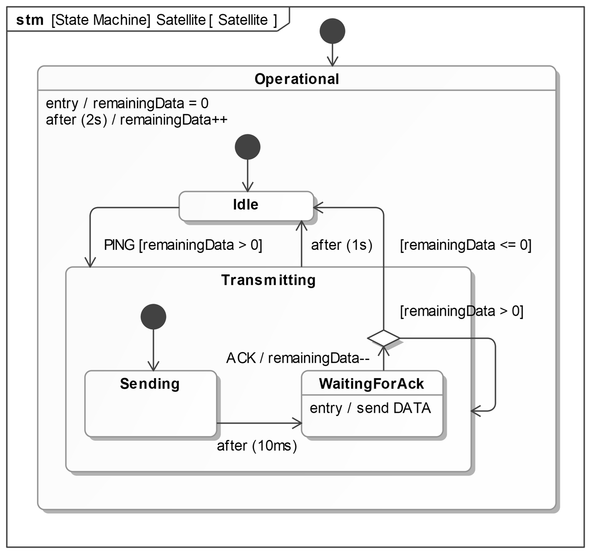
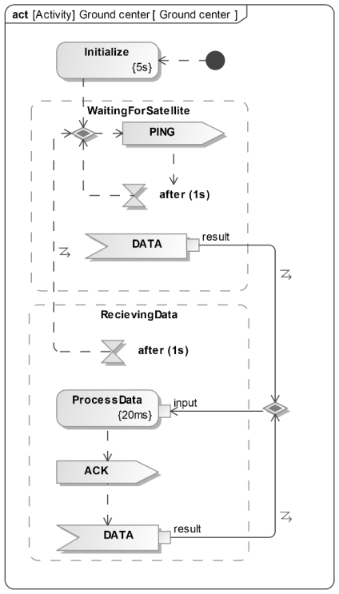
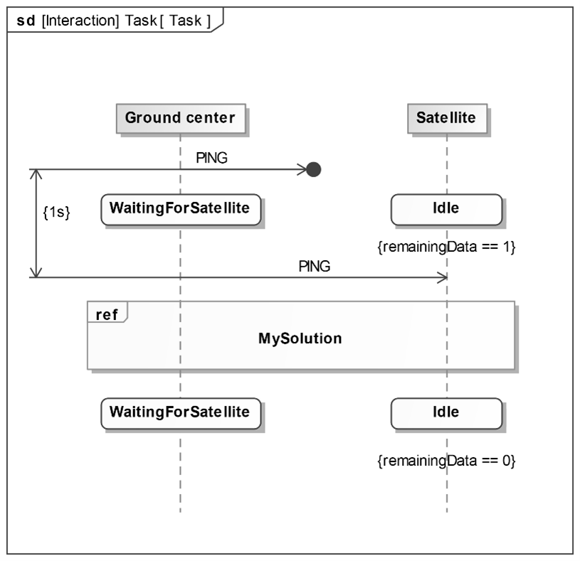

Complete the third part (State Machines) of the tutorial available here: [Behavioral Modeling in Enterprise Architect Tutorial](https://ftsrg-rete.github.io/remo-lecture-notes/ea-tooling-behavior/)

Now that you are familiar with all three diagrams for behavior modeling, complete the following task.

*We are designing a behavioral model of a protocol used to download telemetry data from a satellite. The satellite continuously logs data related to its operation and transmits it when it comes within range of the ground center. Transmissions made outside the coverage range are lost.*

*The exact behavior of the satellite is specified by the following State Machine. The operation of the ground center is described with an Activity Diagram.*

1. Management is furious because none of our employees attended the System Modeling lectures. This unfortunate fact resulted in the horrible Activity Diagram above. Sadly, management did not attend the lectures either, so now they want the complete opposite. As an employee, you have no choice but to:
   
    - create an Activity Diagram describing the satellite behavior based on its State Machine, and
    - create a State Machine model for the ground center that behaves exactly according to the given Activity Diagram.

    Name the states based on the elements of the Activity Diagram, and name the Activity Diagram elements based on the states of the State Machine.

2. Based on the behavior of the two components (we would use the State Machines, but you have *a lot of* choices now), complete the sequence diagram below by replacing the MySolution interaction with an actual sequence diagram fragment that precisely describes one specific valid execution. Assume that:
    - the execution satisfies the elements already present in the diagram, and 
    - no additional messages are lost due to range limitations. 
 
    As before, use messages, timing constraints, and state invariants.

