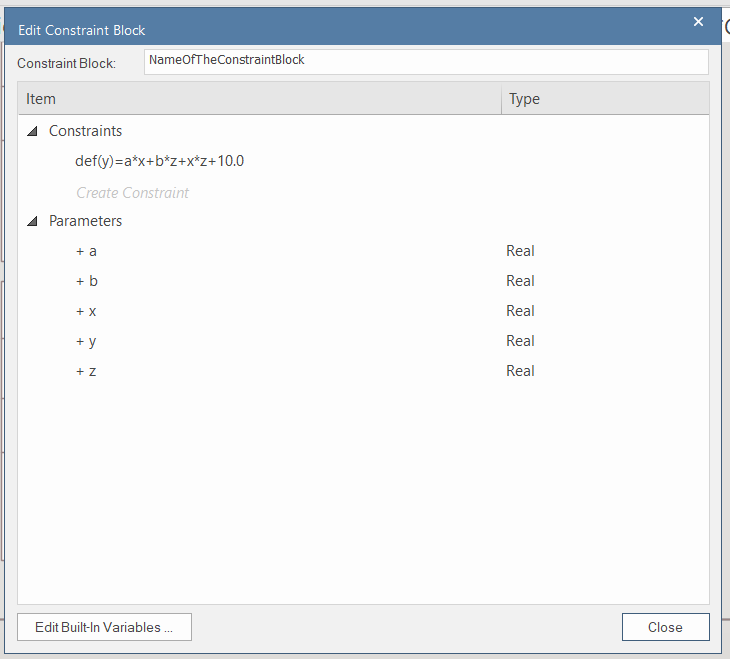
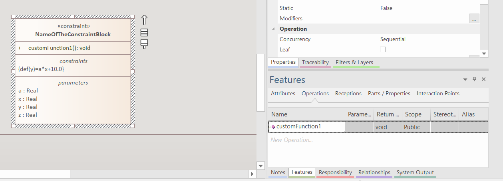

This lab focuses on creating physical models using SysPhS and simulating its behavior using OpenModelica. In this laboratory the vehicle speed control loop of the ACC is modeled. In this document, the control and vehicle models are simplified for the better understanding.

# Useful links

* SysPhS Specification: https://www.omg.org/spec/SysPhS/1.0/PDF
* Official Enterprise Architect documentation:
  * https://sparxsystems.com/enterprise_architect_user_guide/16.1/model_simulation/sysml_parametric_models_2.html
  * https://sparxsystems.com/enterprise_architect_user_guide/16.1/model_simulation/sysml_sim_window.html
  * https://sparxsystems.com/enterprise_architect_user_guide/16.1/model_simulation/sysml_sim_config.html

# Preliminary steps
The following steps will show you, how to install OpenModelica and configure it in Enterprise Architect.

 1. Install OpenModelica
    * On Windows: https://openmodelica.org/download/download-windows/ 
    * On Linux: https://openmodelica.org/download/download-linux
 2. Change perspective to "*Simulation/SysML with Modelica*"
 
 1. In the Simulation tab open "*Modelica/Simulink / SysMLSim Configuration Manager*"
  
 1. In the SysMLSim Configuration Manager, configure the simulation solver
 
 1. Select the location the "*omc.exe*" (in Linux the omc binary)
 

# Try out simulation

The follwing steps will show you how you can create an example SysPhS model using an EA model pattern and how you can run simulations in EA.

 1. In the "*Start Page*" Create the "*Two tanks*" test models from pattern and explore the models
 
 1. Click on the "*TankPI*" SysMLSimulationConfiguration and run the simulation to check if the OpenModelica installed and configured properly
 
 1. After the simulation finished you should see the time plotof the water levels in the tanks and the water flow
   

# Create a structural model

This part of this documents present the preliminary structural modeling steps, which is required for the simulation. 

 1. Create "*Primitive Value Type Library*" using modeling pattern:
 
 2. Create value types to model the physical quantities in the system:
 
 1. Create interface blocks to model the interactions between the components, because of the simulation, the direction of the flow properties shall be set to "*none*":
 
 1. Create the structural composition model of the vehicle with ACC, similarly to laboratory 4:
 
 1. Create the internal block diagram of the system context:
 

# General information about parametric diagrams

This section presents general information about physical modeling. All the later parts of this document will strongly build on the know-hows which are presented in this section.

## Creating contraint blocks

This part shows how one can define constraint blocks.
 1. Use the "*SysML Block Definition*" toolbox to create constraint blocks. 
 
 1. In the pop-up window you can edit the differential equations. You can define any number of constraints within the constraint block. The tool will automatically create parameters by parsing the expressions with a pre-defined "Real" type. If you close the window, a pop-up window will appear and click "*Yes*" or press ENTER.
 
 1. Later you can reopen the constraint block wizard if you right click on the constraint block and select "*Edit ConstraintBlock ...*":
 
 1. If you edit the constraints and some parameters are not in the equations anymore, then the wizard will move the parameters into the "*Not Required Parameters*" cathegory, where you can easily delete the unneccessary parameters:
 
 1. **After you create the block the type of the parameter must be changed from the default built-in "Real" type to some value type.**
 2. Additionally, you can add parameters by defining normal properties. The Enterprise Architect will handle them correctly.

## Creating custom functions within the constraint blocks

Sometimes, it is needed to specify complex realtions between the parameters in the constraint blocks. You can define complex relations using functions and algorithms.
  1. Click on a constraint block and in the "*Features*" window create an operation:
  
  1. In the pop-up windows between the brackets the input and output parameters of operation can be defined:
  
  1. In the "*Code*" tab, the function can be defined:
  
  1. **Click on "*Save*", and then click on "*Close*"**
  2. Add the *\<\<SimFunction\>\>* stereotype to the operation, by clicking on the stereotype editing button in the "*Properties*" window and clicking on "*New*".
  

# Create the physical model

This section presents the physical modeling of the ACC and its environment using parametric diagrams and constraint blocks.

## Modeling the Human-Machine Interface

The HMI sends a speed request to the ACC. Within the control loop, the speed request behaves as a reference signal. During the simulation we assume, that the reference signal does not change. Thus we define a constant value property called "reference speed" and set its initial value to "30.0".

## Modeling the Speed Sensor

The Speed Sensor measures the speed of the vehicle and sends it to the ACC. The physical characteristics of the sensor is simple its input equals to output.
 

## Modeling the Vehicle Propulsion and Dynamics

The speed of the vehicle of the vehicle is dependent on two forces:
 * $F_{engine}$ the accelerating force created by the engine, and
 * $F_{friction}$ the decelerating force created by the friction of the wheels and the mechanical components.

Thus the acceleration of the vehicle can be defined by the following equation:

$a=\frac{\delta v}{\delta t}=\frac{F_{engine}-F_{friction}}{m_{vehicle}}$

The accelerating force of the engine is defined by the following equation if the speed of vehicle is not zero:
$F_{engine}=\frac{P}{v}$.

If $v$ is smaller than $5 m/s$ we assume that the vehicle is accelerated by a constant force:
$F_{engine}=2000 N$.

The decelerating force is speed dependent and can be calculated by the following equation:
$F_{friction}=v\cdot b$, where $b$ is the damping coeffitient and $b=50 \frac{N\cdot s}{m}$

To model the engine and the vehicle, we define separated constraint blocks for the engine, the braking force and the vehicle dynamics. 

Within the engine characteristics we define an operation to model the nonlinarity of engine acceleration near small speeds:

We define the overall physical characteristics of the vehicle using a parametric diagram:

## Modeling the ACC

Within the ACC we define a simple P controller. The P controller contains three parts:
 1. **Error calculation**: firstly the controller calculates the difference between the reference speed and the speed measurement.
 2. **Control calculation**: thereafter the P controller multiplies the error with a predefined gain, which is in this case $0.5$. The result of the multiplication will show that how much fraction of the maximal motor performance is required.
 3. **Power actuation request calculation**: finally, the ACC ensures that the control value cannot be greater than $1.0$ and multiples the control value with the maximal power to calculate the engine performance request.

For the better transparency it is advantegeous to model the three steps separately using three constrain blocks:

Within the "*Power Request Calculation*" an operation shall be defined to ensure that ACC does not want to request more power than the maximal engine performance, which is $P_{max}=100\space HP \approx 75 \space 000\space W$.

The overall behavior of the ACC can be defined using a parametric diagram, where binding connectors connects the parameters of the constraint parameters and the flow properties of the ACC:

# Simulation of system behavior

After you created the detailed model of the ACC and the vehicle you can simulate the differential equations using OpenModelica.

 1. Ensure that you defined the initial value for all value property which, where it is important. Defining the initial value is especially important for constant value properties. If you do not specify inital value then zero will be the default initial value.
 
 1. Using the "*Simulation*" toolbox, create a SysMLSimConfiguration artifact:
 
 1. Double click on the simulation artifact and the SysML Configuration Manager will automatically appear. In the configuration manager select the package where the models are stored:
 
 1. Set the block of the system context ("*Vehicle with ACC*") as "*SysMLSimModel*":
 
 1. Set all constant value property of the blocks as "*SimContant*", to denote for the simulator that their value cannot change:
 

1. Set how long you want to run the simulation and select which value properties shall appear in the simulation plot:

1.  Validate model to find possible errors. The errors will appear in the "*System Output*" window.
2. If there is no validation error then run the simulator by clicking on the large "Solve" button. After a few seconds the time-series plot of the selected value properties will appear:

1. Run the simulation multiple times with different gain alues in the control loop and with different reference speed request in the HMI and with different initial vehicle speed values.