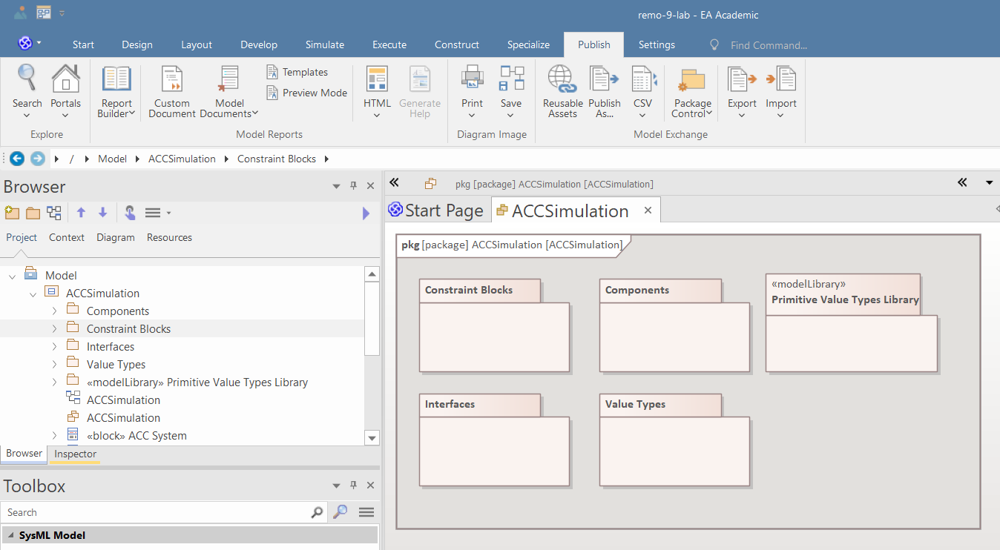

This lab focuses on creating physical models using SysPhS and simulating their behavior using OpenModelica. In this laboratory, the vehicle speed control loop of the ACC is modeled. The control and vehicle models are simplified for better understanding.

# Useful links

* EA data and interface modeling guide: https://ftsrg-rete.github.io/remo-lecture-notes/data-and-interface-modeling-guide/
* EA composition modeling guide: https://ftsrg-rete.github.io/remo-lecture-notes/composition-modeling-guide/
* EA structural modeling guide: https://ftsrg-rete.github.io/remo-lecture-notes/structural-modeling-guide/
* EA parametric modeling guide:https://ftsrg-rete.github.io/remo-lecture-notes/parametric-modeling-guide/
* Official Enterprise Architect documentation:
    * https://sparxsystems.com/enterprise_architect_user_guide/16.1/model_simulation/sysml_parametric_models_2.html
    * https://sparxsystems.com/enterprise_architect_user_guide/16.1/model_simulation/sysml_sim_window.html
    * https://sparxsystems.com/enterprise_architect_user_guide/16.1/model_simulation/sysml_sim_config.html
* SysPhS Specification: https://www.omg.org/spec/SysPhS/1.0/PDF

**Note: knowledge of the SysPhS specification is not needed to complete this lab.**

# Preliminary steps
The following steps will show you how to install OpenModelica and configure it in Enterprise Architect.

 1. Install OpenModelica
    * Download installer for Windows: https://openmodelica.org/download/download-windows/ 
    * Download installer for Linux: https://openmodelica.org/download/download-linux
 2. Change perspective to "*Simulation/SysML with Modelica*"
 
 1. In the Simulate tab, open "*Modelica/Simulink / SysMLSim Configuration Manager*" (Note: a model must be opened in EA to open the Configuration Manager. The solver setup will be global; any model can be opened for this step.)
  
 1. In the SysMLSim Configuration Manager, configure the simulation solver
 
 1. Select the location of "*omc.exe*" (on Linux, the omc binary)
 
 1. Make sure that in the Portal>Window menu you opened the "*Features*" and "*Properties*" windows: https://ftsrg-rete.github.io/remo-lecture-notes/general-modeling-guide/#ablakok-beallitasa 

# Try out the simulation

The following steps will show you how you can create an example SysPhS model using an EA model pattern and how you can run simulations in EA.

 1. On the "*Start Page*" Create the "*Two tanks*" test models from pattern and explore the models
 
 1. Click on the "*TankPI*" SysMLSimulationConfiguration and run the simulation to check if the OpenModelica is installed and configured properly
 
 1. After the simulation finished, you should see the time plot of the water levels in the tanks and the water flow
   

# Create a structural model

This part of this document presents the preliminary structural modeling steps, which are required for the simulation. 

 1. Create "*Primitive Value Type Library*" using modeling pattern:
 
 1. Create packages for the Value Types, Components, Interfaces, and Constraint blocks:
 
 2. Create value types to model the physical quantities in the system:
 
 1. Create interface blocks to model the interactions between the components, because of the simulation, the direction of the flow properties shall be set to "*none*":
 
 1. Create the structural composition model of the vehicle with ACC, similarly to laboratory 4:

 2. Create the internal block diagram of the system context (which is modeled by the "*Vehicle with ACC*" block):
 

**Check: Take a screenshot of your IBD, and put it into your documentation.**

# Create the physical model

This section presents the physical modeling of the ACC and its environment using parametric diagrams and constraint blocks.

## Modeling the Human-Machine Interface

The HMI sends a speed request to the ACC. Within the control loop, the speed request behaves as a reference signal. During the simulation, we assume that the reference signal does not change. Thus, we define a constant value property called "reference speed" and set its initial value to "30.0".

## Modeling the Speed Sensor

The Speed Sensor measures the speed of the vehicle and sends it to the ACC. The physical characteristics of the sensor are simple: its output equals its input.
 

## Modeling the Vehicle Propulsion and Dynamics

The speed of the vehicle is dependent on two forces:
 * $F_{engine}$: the accelerating force created by the engine, and
 * $F_{friction}$: the decelerating force created by the friction of the wheels and the mechanical components.

Thus, the acceleration of the vehicle can be defined by the following equation:

$a=\frac{\delta v}{\delta t}=\frac{F_{engine}-F_{friction}}{m_{vehicle}}$

The accelerating force of the engine is defined by the following equation if the speed of vehicle is not zero:
$F_{engine}=\frac{P}{v}$.

If $v$ is smaller than $5 m/s$ we assume that the vehicle is accelerated by a constant force:
$F_{engine}=2000 N$.

The decelerating force is speed-dependent and can be calculated by the following equation:
$F_{friction}=v\cdot b$, where $b$ is the damping coefficient and $b=50 \frac{N\cdot s}{m}$

To model the engine and the vehicle, we define separate constraint blocks for the engine, the braking force, and the vehicle dynamics. 

Within the engine characteristics, we define an operation to model the nonlinearity of engine acceleration near small speeds:

We define the overall physical characteristics of the vehicle using a parametric diagram:

**Check: Take a screenshot of your parametric diagram, and put it into your documentation.**

## Modeling the ACC

Within the ACC, we define a simple P controller. The P controller contains three parts:
 1. **Error calculation**: First, the controller calculates the difference between the reference speed and the speed measurement.
 2. **Control calculation**: Thereafter, the P controller multiplies the error with a predefined gain, which is in this case $0.5$. The result of the multiplication will show what fraction of the maximal motor performance is required.
 3. **Power actuation request calculation**: Finally, the ACC ensures that the control value cannot be greater than $1.0$ and multiples the control value with the maximal power to calculate the engine performance request.

For better transparency, it is advantageous to model the three steps separately using three constraint blocks:

**Note: If you use the built-in *Real* type from the drop-down menu instead of the *Real* valuetype defined in the *Primitive Value Types Library*, then the property will appear in the *paramaters* compartment instead of the *values* compartment. The simulation should still work.** 

Within the "*Power Request Calculation*", an operation shall be defined to ensure that ACC does not want to request more power than the maximal engine performance, which is $P_{max}=100\space HP \approx 75 \space 000\space W$.

The overall behavior of the ACC can be defined using a parametric diagram, where binding connectors connect the parameters of the constraint parameters and the flow properties of the ACC:

**Check: Take a screenshot of your parametric diagram, and put it into your documentation.**

After you have created all model elements, the BDD of the system context will look similar to this:

# Simulation of system behavior

After you have created the detailed model of the ACC and the vehicle, you can simulate the differential equations using OpenModelica.

 1. Ensure that you have defined the initial value for every value property, where it is important. Defining the initial value is especially important for constant value properties. If you do not specify an initial value, then zero will be the default initial value.
 
 1. Using the "*Simulation*" toolbox, create a SysMLSimConfiguration artifact:
 
 1. Double click on the simulation artifact, and the SysML Configuration Manager will automatically appear. In the configuration manager, select the package where the models are stored:
 
 1. Set the block of the system context ("*Vehicle with ACC*") as "*SysMLSimModel*":
 
 1. Set all constant value properties of the blocks as "*SimConstant*", to denote for the simulator that their value cannot change:
 

1. Set how long you want to run the simulation and select which value properties shall appear in the simulation plot:

1. Validate the model to find possible errors. The errors will appear in the "*System Output*" window.  **Check: After correcting any errors, take a screenshot of your simulation configuration and put it into your documentation. (Note: The summary at the end of the validation result might say that there are more than zero errors even though it lists only warnings. Eliminating explicitly stated errors in the list is enough, but make sure that you get zero errors in the logs of the next step.)**
2. If there is no validation error, then run the simulator by clicking on the large "Solve" button. After a few seconds, the time-series plot of the selected value properties will appear:

1. Run the simulation multiple times with different gain values in the control loop, with different reference speed requests in the HMI, and with different initial vehicle speed values. **Take a screenshot of the generated plots with each setup, and put it into your documentation.**

**Overall, your documentation should contain a screenshot (or a diagram export) for each of the following:**
- the IBD
- the Parametric Diagram of the vehicle dynamics
- the ACC's Parametric Diagram
- the simulation configuration
- the generated plots for at least two setups (different gain values, reference speeds, initial speed values).
