# Preliminary steps
The following steps will show you how to install OpenModelica and configure it in Enterprise Architect.

 1. Install OpenModelica
    * On Windows: https://openmodelica.org/download/download-windows/ 
    * On Linux: https://openmodelica.org/download/download-linux
 2. Change perspective to "*Simulation/SysML with Modelica*"
 
 1. In the Simulate tab, open "*Modelica/Simulink / SysMLSim Configuration Manager*"
  
 1. In the SysMLSim Configuration Manager, configure the simulation solver
 
 1. Select the location of "*omc.exe*" (on Linux, the omc binary)
 
 1. Make sure that in the Portal>Window menu you opened the "*Features*" and "*Properties*" windows: https://ftsrg-rete.github.io/remo-lecture-notes/general-modeling-guide/#ablakok-beallitasa 

# Try out the simulation

The following steps will show you how you can create an example SysPhS model using an EA model pattern and how you can run simulations in EA.

 1. On the "*Start Page*" Create the "*Two tanks*" test models from pattern and explore the models
 
 1. Click on the "*TankPI*" SysMLSimulationConfiguration and run the simulation to check if the OpenModelica is installed and configured properly
 
 1. After the simulation finished, you should see the time plot of the water levels in the tanks and the water flow
   

 
# General information about parametric diagrams

This section presents general information about physical modeling and defining parametric diagrams.

## Creating constraint blocks

This part shows how one can define constraint blocks.
 1. Use the "*SysML Block Definition*" toolbox to create constraint blocks. 
 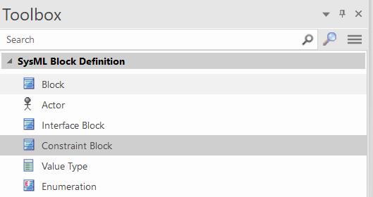
 1. In the pop-up window, you can edit the differential equations. You can define any number of constraints within the constraint block. The tool will automatically create parameters by parsing the expressions with a pre-defined "Real" type. If you close the window, a pop-up window will appear. Click "*Yes*" or press ENTER.
 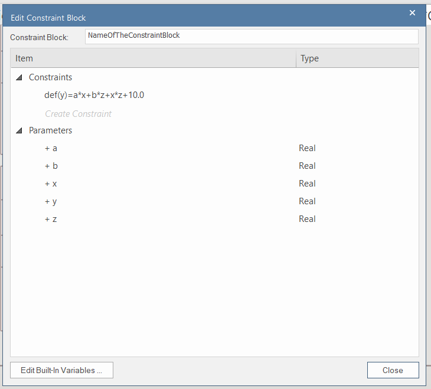
 1. Later, you can reopen the constraint block wizard if you right-click on the constraint block and select "*Edit ConstraintBlock ...*":
 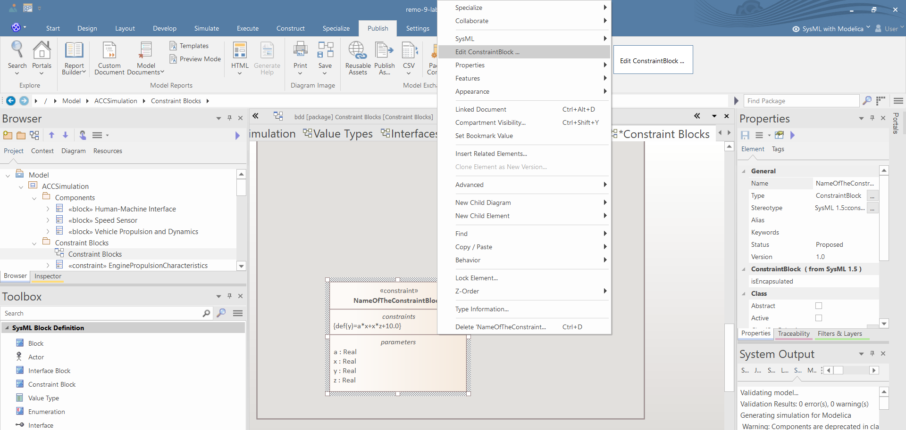
 1. If you edit the constraints and some parameters are not in the equations anymore, then the wizard will move the parameters into the "*Not Required Parameters*" category, where you can easily delete the unnecessary parameters:
 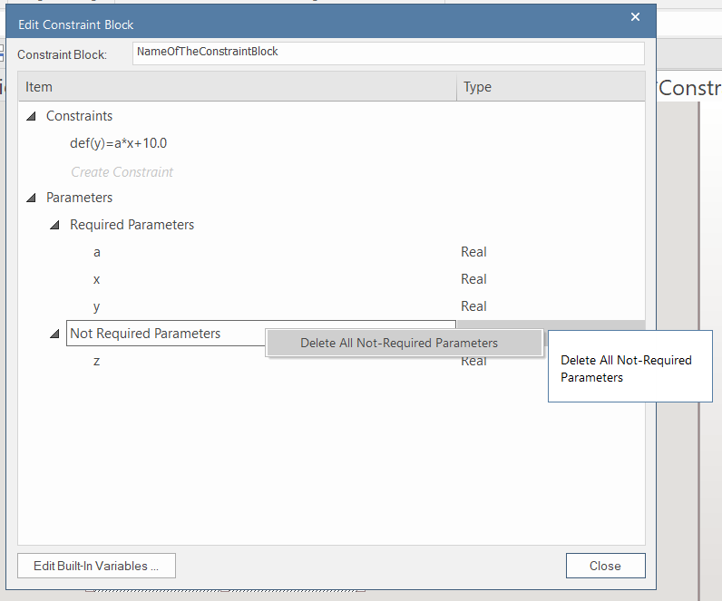
 1. **After you create the block, the type of the parameter must be changed from the default built-in "Real" type to some value type.**
 2. Additionally, you can add parameters by defining normal properties. The Enterprise Architect will handle them correctly.

## Creating custom functions within the constraint blocks

Sometimes, it is needed to specify complex relations between the parameters in the constraint blocks. You can define complex relations using functions and algorithms.
  1. Click on a constraint block and in the "*Features*" window, create an operation:
  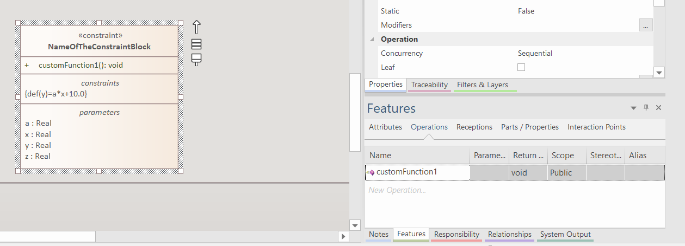
  1. In the pop-up windows between the brackets, the input and output parameters of the operation can be defined:
  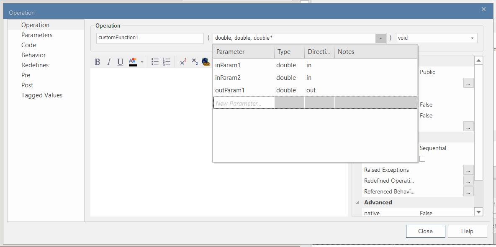
  1. In the "*Code*" tab, the function can be defined:
  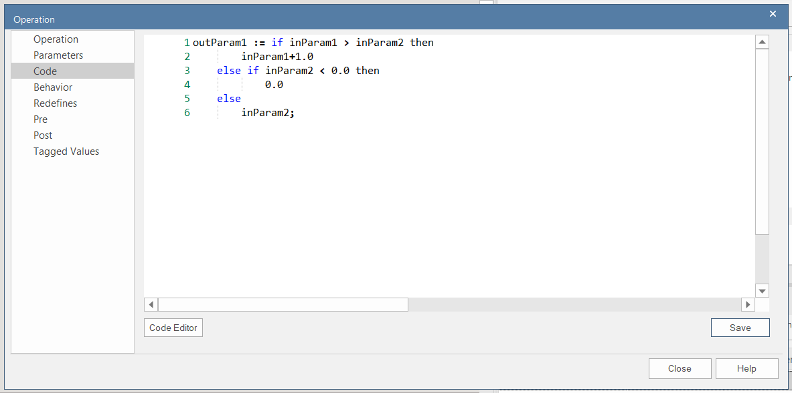
  1. **Click on "*Save*", and then click on "*Close*"**
  2. Add the *\<\<SimFunction\>\>* stereotype to the operation, by clicking on the stereotype editing button in the "*Properties*" window and clicking on "*New*".
  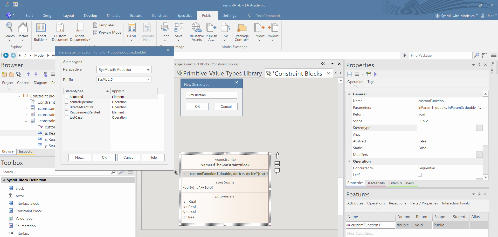

## Define parametric diagrams

  1. Right click on a block and select "*New Child Diagram/Parametric Diagram*" :
  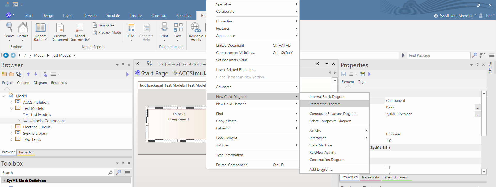
  1. Create constraint property by dragging a constraint block to the diagram:
  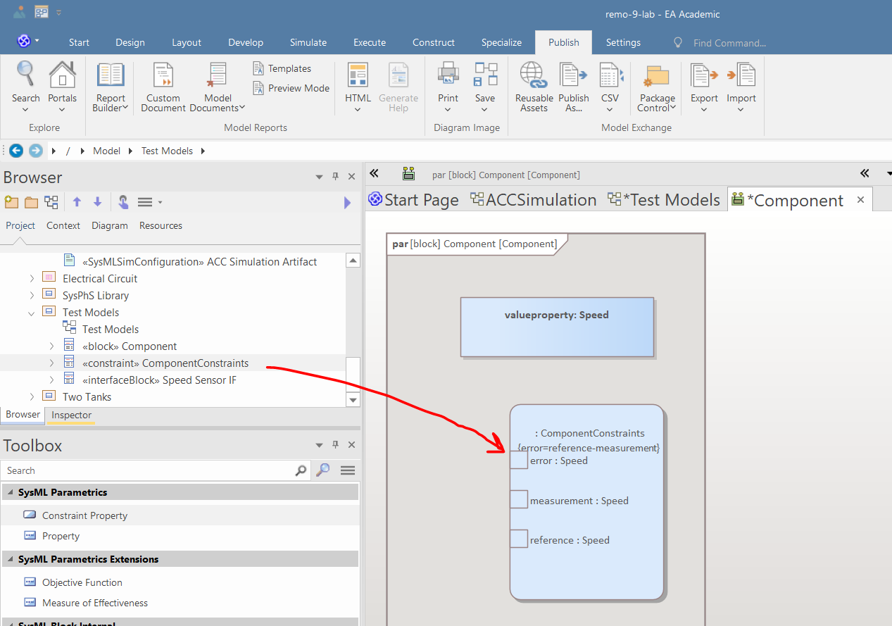
  1. Create a value property by dragging a value type into the diagram and selecting in the pop-up window "*Drop as: Property*"
  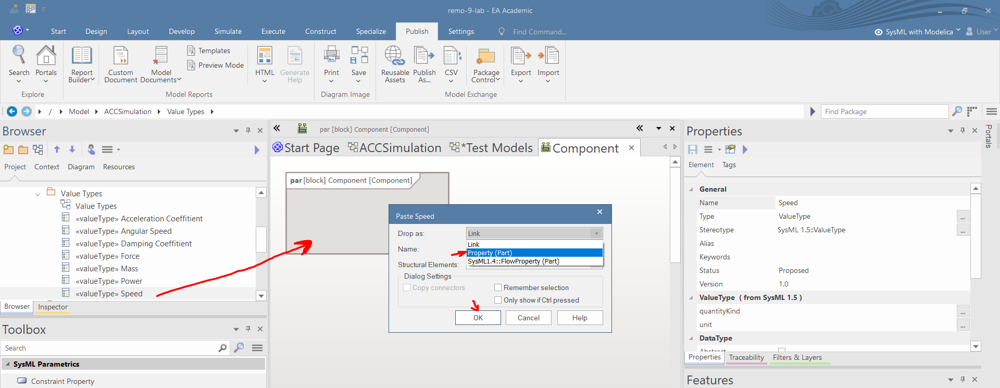
  1. Set the initial values in the "*Property*" tab of the properties window:
  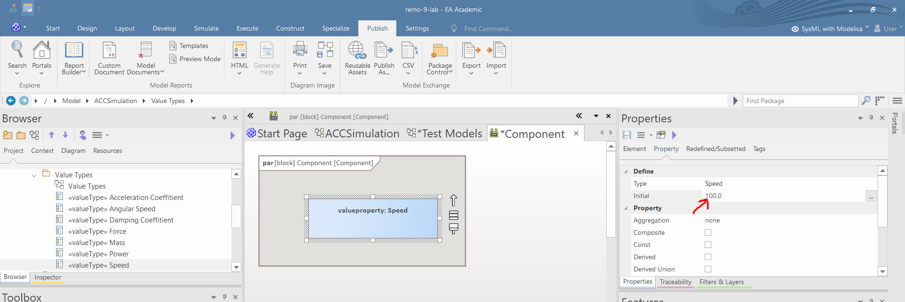
  1. If a value property is constant, then you should set the "*Const*" checkbox in the "*Property*" tab of the properties window:
  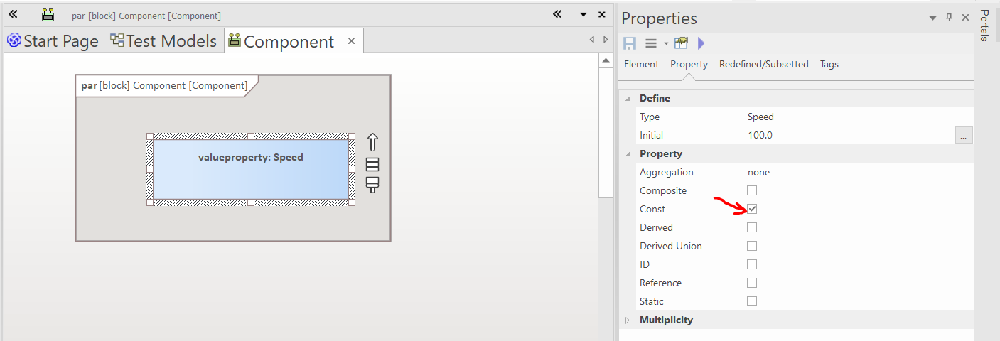
  1. Add (or hide) existing value properties and parameters of ports and constraint properties to the parametric diagram by setting the checkbox in the "*Parts/Properties*" tab of the features window:
  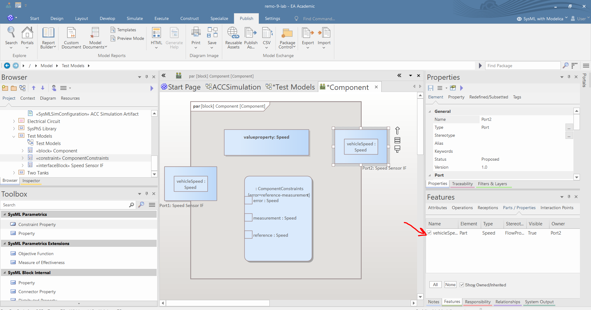
