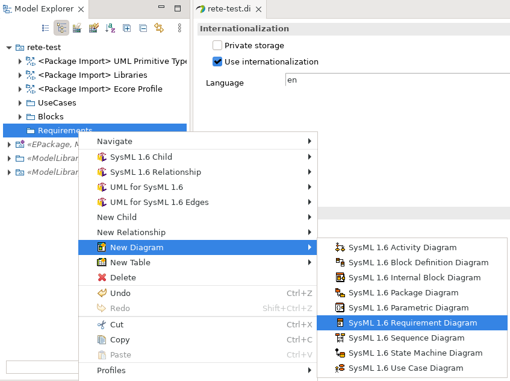
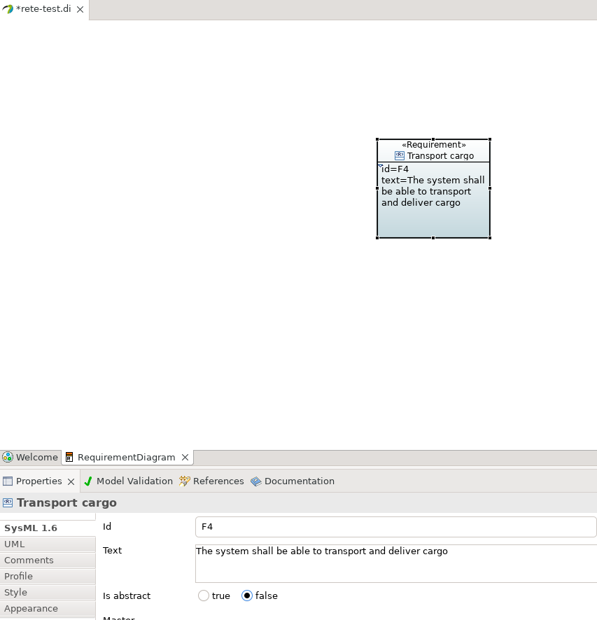
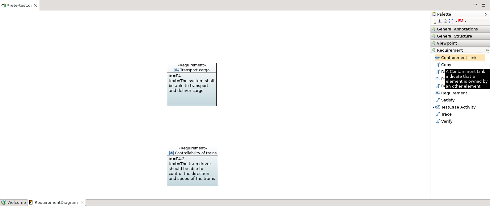
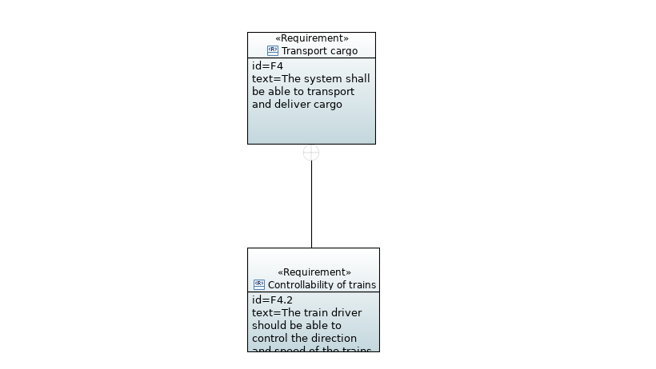
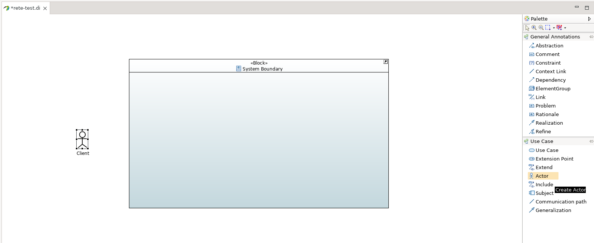
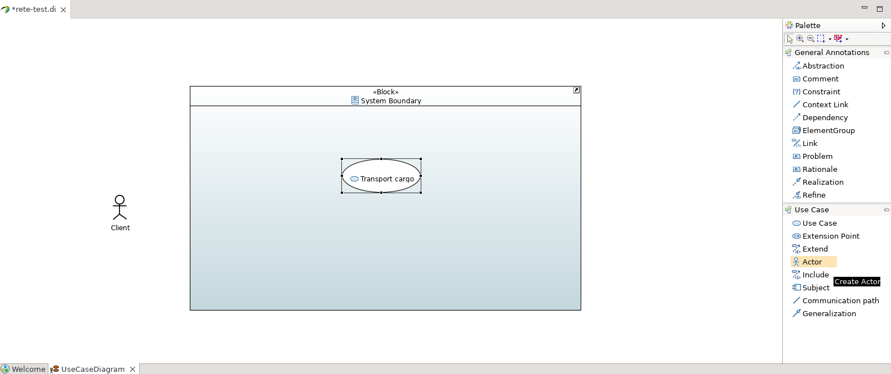
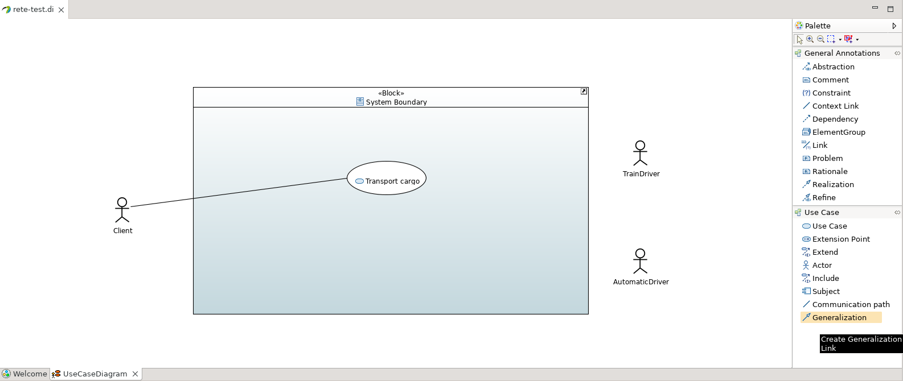
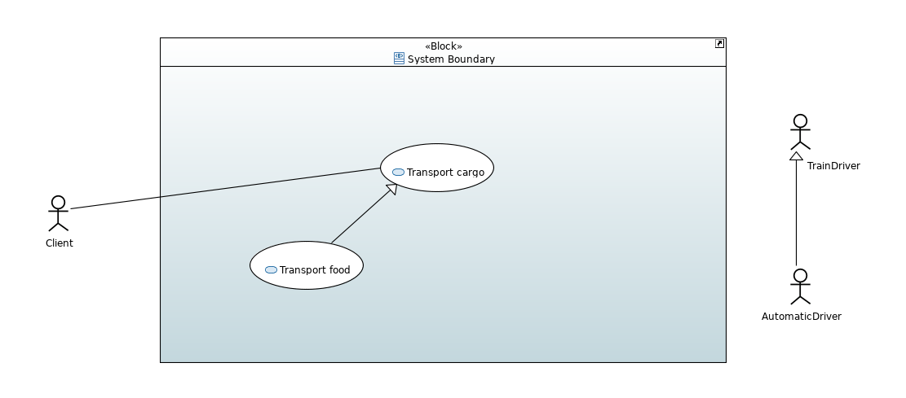
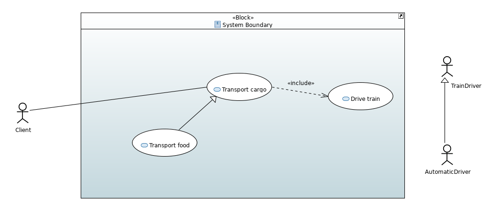
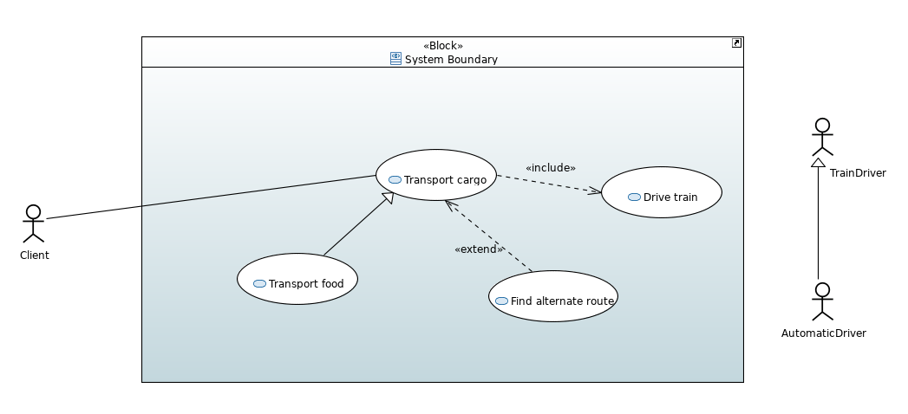

# Követelmény modellezés

## Diagram létrehozás

1. **Jobb katt** a kiválasztott _Package_-en (_Requirements_ ebben a példában) -> **New Diagram** -> **SysML 1.6 Use Case Diagram**.

2. _Requirement_ hozzáadáshoz a **Palette**-ről válasszuk ki az **Requirement**-t és helyezzük el a diagramon, majd a **Properties** ablakban a **SysML 1.6** fülön töltsük ki az _**Id**_ és a _**Text**_ mezőket. 

## Követelmények lebontása

1. _Requirement_ lebontásához (_Decomposition_) a **Palette**-ről válasszuk ki a **Containment Link**-t, majd kössük össze vele a két _Requirement_-ünket. Figyeljünk a nyilak helyes irányára!

## Követelmények származtatása

1. _Requirement_ származtatásához (_Derive_) a **Palette**-ről válasszuk ki a **DeriveReqt**-t, majd kössük össze vele a két _Requirement_-ünket. Figyeljünk a nyilak helyes irányára!

# Use case Modellezés

## Diagram létrehozás

1. **Jobb katt** a kiválasztott _Package_-en (_UseCases_ ebben a példában) -> **New Diagram** -> **SysML 1.6 Use Case Diagram**.

2. **Drag-and-drop** használatával helyezzük rá a rendszer határát (_System Boundary_) reprezentáló block-ot a diagramra.

## Actorok és Use Case-ek felvétele

1. _Actor_ hozzáadáshoz a **Palette**-ről válasszuk ki az **Actor**-t és helyezzük el a diagramon. 

2. _Use Case_ hozzáadáshoz a **Palette**-ről válasszuk ki az **Use Case**-t és helyezzük el a diagramon.

3. _Asszociáció_ (_Association_) felvételéhez a **Palette**-ről válasszuk ki a **Communication Path**-t, majd kössük össze vele az _Actor_-t és a _Use Case_-t.

## Actorok közötti kapcsolatok felvétele

1. Leszármazás (_Generalization_) felvételéhez a **Palette**-ről válasszuk ki a **Generalization**-t, majd kössük össze vele a két _Actor_-unkat.

## Use Case-ek közötti kapcsolatok felvétele
1. Leszármazás (_Generalization_) felvételéhez a **Palette**-ről válasszuk ki a **Generalization**-t, majd kössük össze vele a két _Use Case_-ünket.

2. _Use Case_ finomításához (_Refinement_) a **Palette**-ről válasszuk ki a **Include**-t, majd kössük össze vele a két _Use Case_-ünket. Figyeljünk a nyilak helyes irányára!

3. _Use Case_ bővítéséhez (_Extension_) a **Palette**-ről válasszuk ki a **Extend**-t, majd kössük össze vele a két _Use Case_-ünket. Figyeljünk a nyilak helyes irányára!

