# Create a glossary

A glossary can be created in multiple ways; this tutorial shows the simplest one. In EA, the definitions are modeled by classes with the <<*GlossaryEntry*\>\> stereotype. The name of the class is the defined expression, and the note of the class is the definition of the expression. The glossary entries are organized into categories, which are packages with the <<*GlossaryCategory*\>\> stereotype. The glossary is a UML class diagram in "*Specification View*".

1. Create a package and select the "*Select and Apply Model Pattern*".
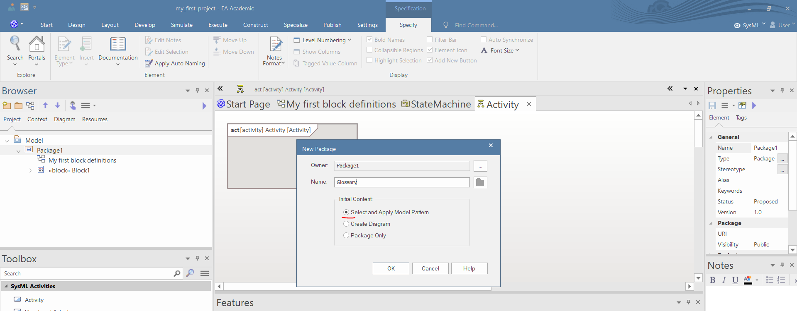
1. Choose the "*SysML Glossary*" pattern. This pattern will create a simple glossary with the definitions of the SysML's modeling elements. Click on "*Create Model*"-
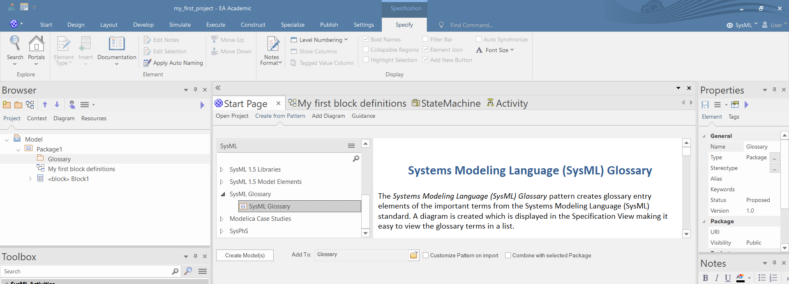
1. Right-click on the glossary diagram and select "*Switch View/Graphical View*".

1. Delete all the glossary entries except one, rename the remaining entry, and modify its note. Using the toolbox, you can add new categories and entries. After you have finished the glossary definitions, change the view of the diagram back to "*Specification*" mode.
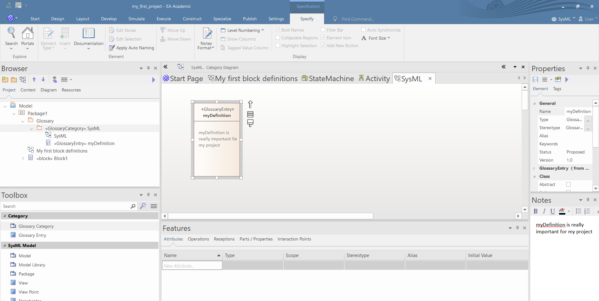
1. Alternatively, you can add glossary entries if you set the perspective to "*Publishing/Glossary*" and click on "*Add New*".
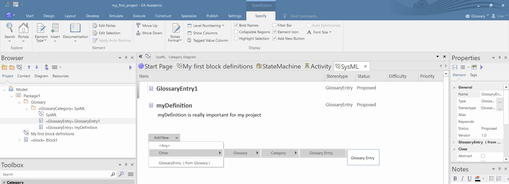

# Requirement modeling

1. Create a requirement diagram. Define some requirements using the Toolbox.

1. Set the ID of the requirement in the Properties window.

1. Set the Text of the requirement by clicking the three-dot icon in the Properties window. Write the text of the requirement in the pop-up window and press OK.

1. If the Text and the ID do not appear in the diagram, then click on the diagram, and in the Compartments tab of the Properties window, turn on the visibility of tags.
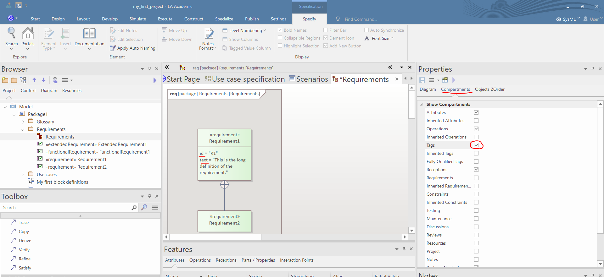
1. For SysML Requirement Extensions, the attributes of the requirements can be specified in the Properties window.
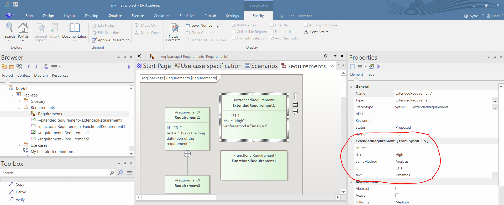

# Use case modeling

1. Create a SysML use case diagram and define some use cases using the Toolbox. Add some notes to the use cases.
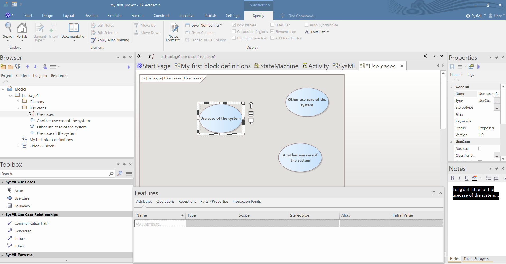
1. Define the actors, the boundaries of the system, and the relations between the modeling elements using the Toolbox.
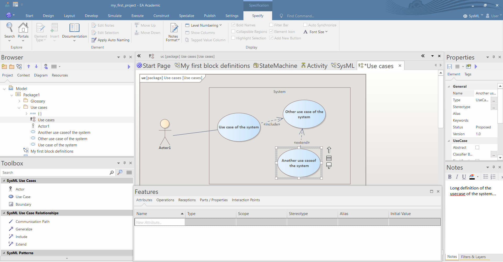
1. Create another use case diagram and pull the previously defined use cases into the diagram. You may give the diagram a name similar to "*Use case specifications*".

1. Change the view of the diagram into "*Specification View*".

## Scenarios of the use cases
1. If you double-click on any use case, then EA will automatically open the "*Scenario Specification*" of the selected use case.

1. In the newly opened "*Scenario*" window, you can specify the basic path of the use case. You can add steps to the path if you write the name of the step in the "*new step*" field. Additionally, you can specify the used and resulting objects of the step in the "*Uses*" and "*Results*" columns, respectively. You can use the "*State*" column to specify that the step occurs in a specific state of the system.

2. If you select a step, then you can move the step forward and backward using the green arrows in the top menu bar.

3. If you select a step, then you can add alternate and exception paths using the yellow and orange path icons in the top menu bar.

1. If you create an alternate or exception path, then you can add steps to the path in the table. You can select different paths in the "*Entry Points*" tab below the table of steps. If you select a path, then you can change the type (basic/alternate/exception) and the name of the path in the "*Type*" and "*Scenario*" fields.
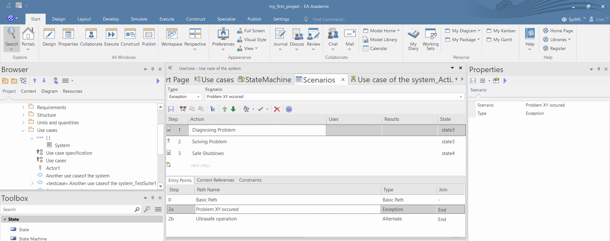
1. After you have created the paths and steps of the paths, then you can generate an activity diagram from the scenario definition by clicking the diagram icon and selecting "*Activity with ActivityParameter*". This command will automatically create an activity and a UML Activity diagram.   

2. In the diagram, each step is an activity action, and the in- and output of the actions are activity parameters. The alternate and exception paths are transformed into "*decision*" control nodes. 
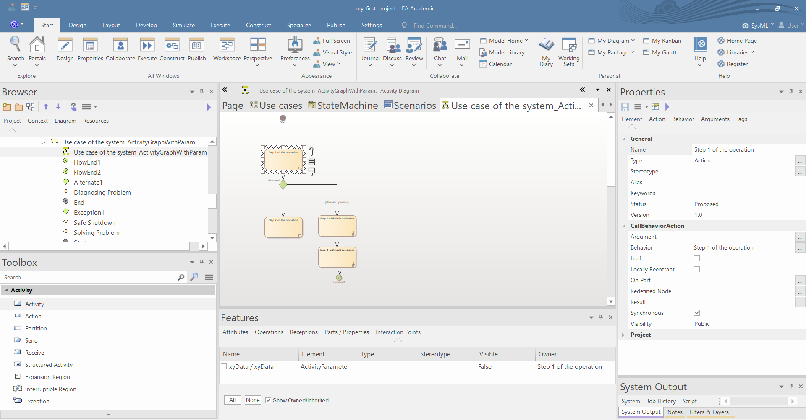
3. You can visualize the inputs and the outputs of the activities if you select an action and in "*Interaction Points*" tab of the Features window turn on the visibility of the activity parameters. Thereafter, you can connect the activity parameters with object flow.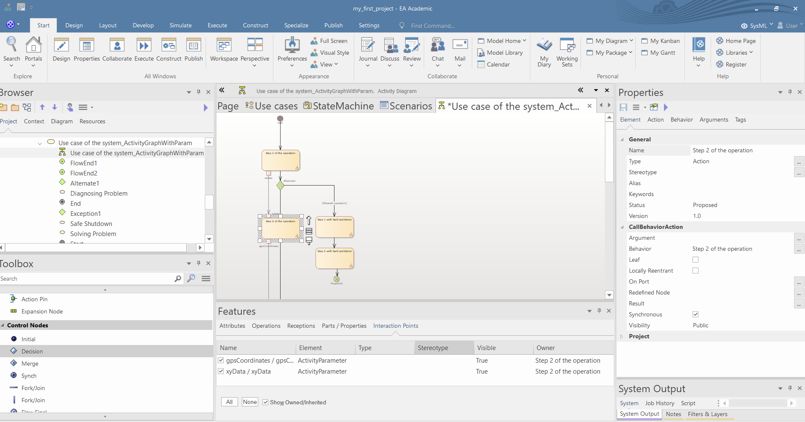
4. Alternatively, you can generate a state machine diagram from the scenarios. In the state machine diagram, the transitions are generated from the actions, and the states of the diagram are defined by the "*State*" column of the scenario table.
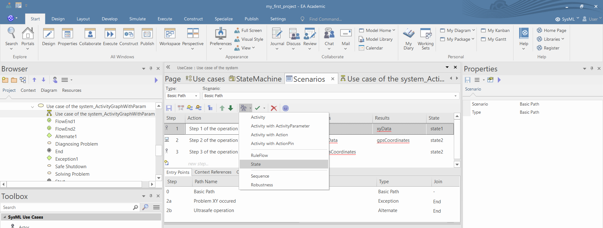
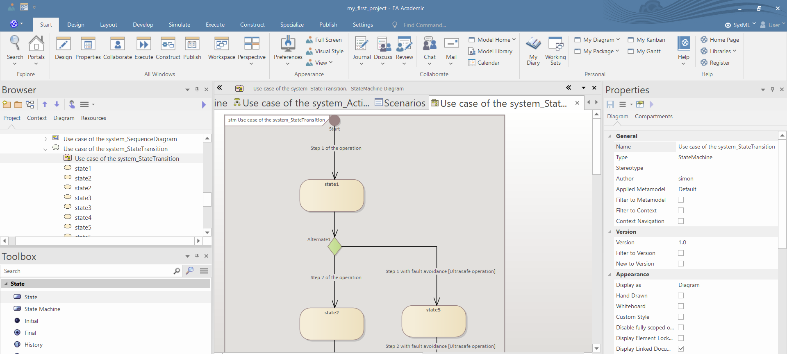

## Constraints of use cases

1. If you double-click on any use case, then EA will automatically open the "*Scenario Specification*" of the selected use case.

1. In the "*Constraints*" tab of the "*Scenario*" window, you can specify the constraints of the use cases. 
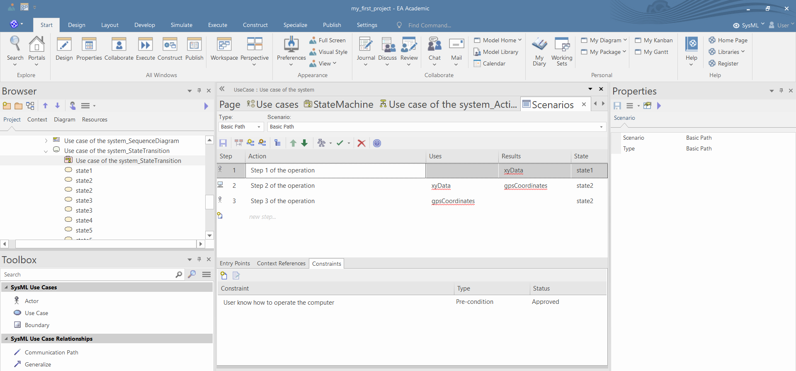
1. If you click on the "Add New" icon in the constraints tab, you can add a constraint to the use case.

1. In the pop-up window, you can specify the name of the constraint in the "*Constraint*" field, and you can set the type (Invariant/Pre-condition/Post-condition) of the constraint in the "*Properties*" field. Below the name of the constraint, you can add some notes to the constraint. You can apply the changes by clicking on the "*Save*" button.
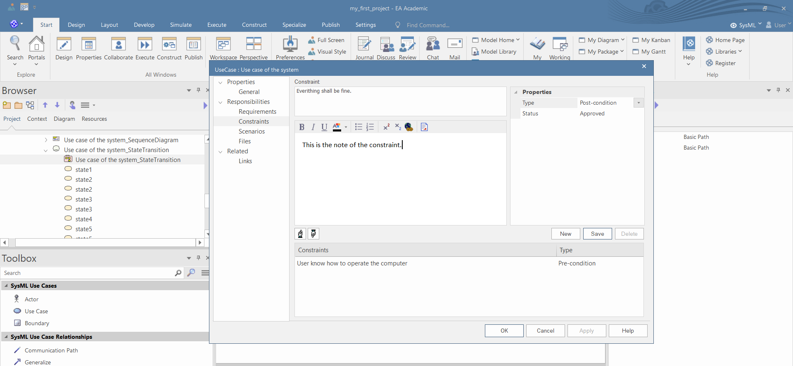
1. The new constraint will appear in the "*Constraints*" tab. You can edit existing constraints if you double-click on the constraint.

1. Alternatively, you can add and modify constraints if you right-click on a use case, select the "*Properties*" option, and then select the "*Responsibilities/Constraints*" tab in the pop-up window.
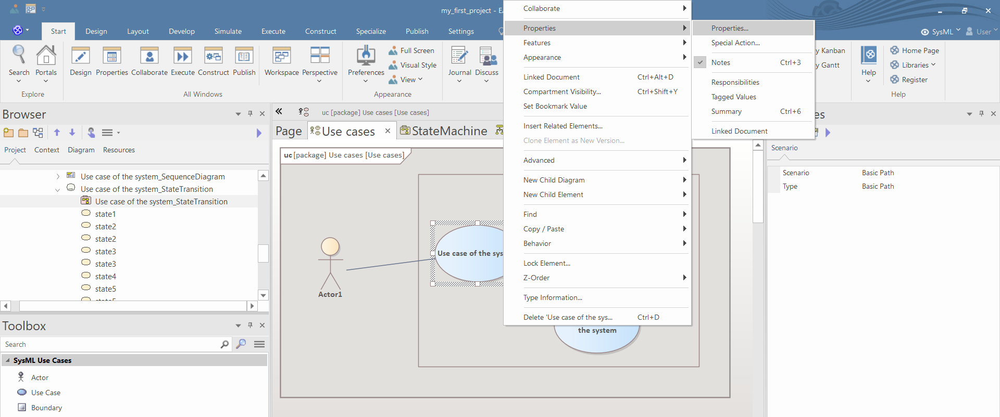
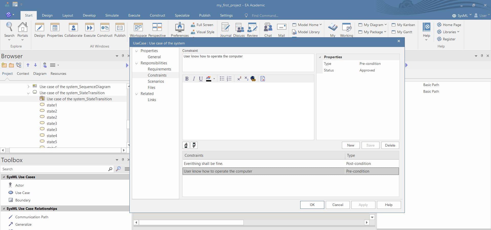

