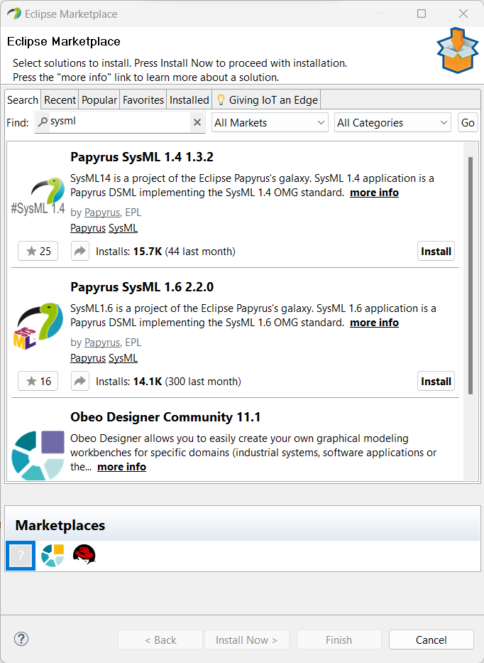
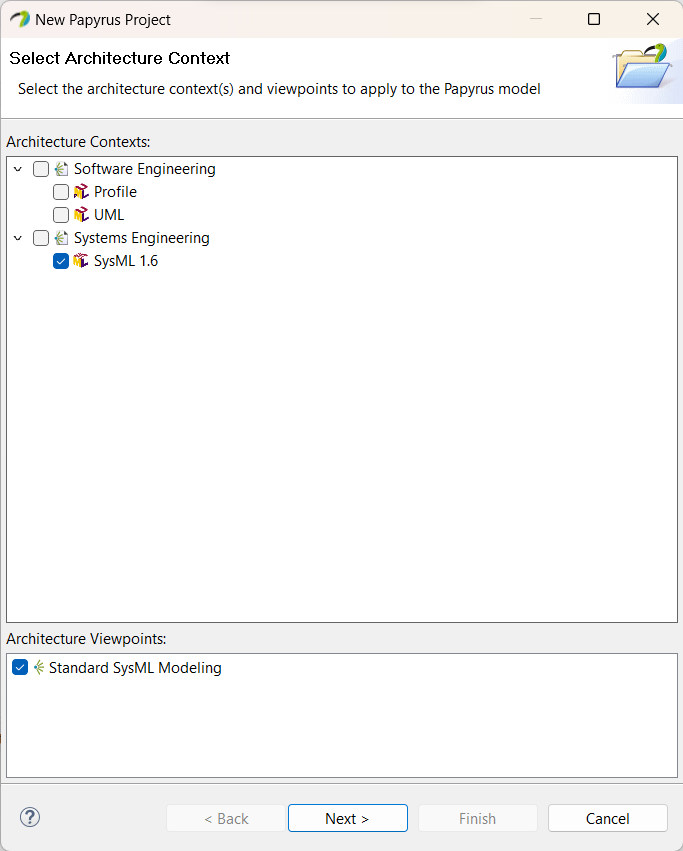
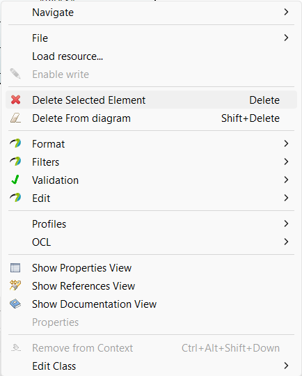
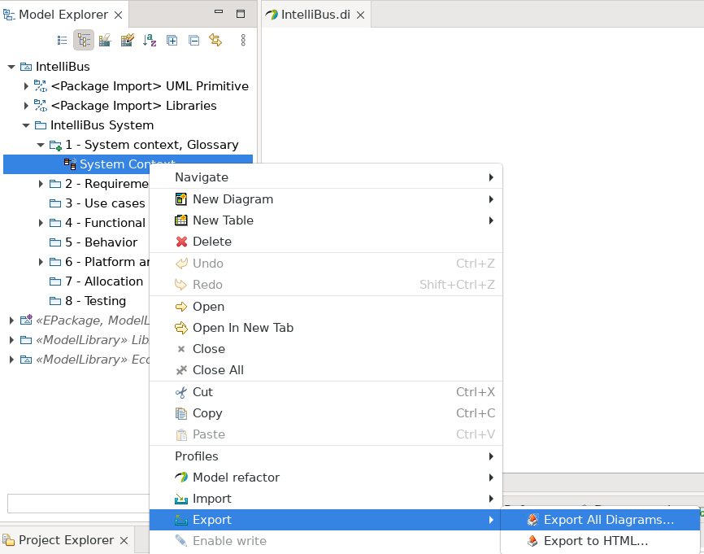

# Papyrus installation

1. Download the papyrus installer: 
    1. Linux: [https://www.eclipse.org/downloads/download.php?file=/modeling/mdt/papyrus/rcp/2022-03/6.1.0/papyrus-2022-03-6.1.0-linux64.tar.gz&mirror_id=1190](https://www.eclipse.org/downloads/download.php?file=/modeling/mdt/papyrus/rcp/2022-03/6.1.0/papyrus-2022-03-6.1.0-linux64.tar.gz&mirror_id=1190 )
    1. Windows: [https://www.eclipse.org/downloads/download.php?file=/modeling/mdt/papyrus/rcp/2022-03/6.1.0/papyrus-2022-03-6.1.0-win64.zip](https://www.eclipse.org/downloads/download.php?file=/modeling/mdt/papyrus/rcp/2022-03/6.1.0/papyrus-2022-03-6.1.0-win64.zip)
1. Extract the downloaded file.
1. Start Papyrus from the  _papyrus-\<version\>/Papyrus_ folder
1. Open Eclipse Marketplace: **Help**->**Eclipse Marketplace**, then search for _sysml_ and install the **Papyrus SysML 1.6** extension. Pay attention to the version number.

{height=48%}

# User Interface

## Model Explorer
One of the most used part of the interface is the **Model Explorer**, which shows the elements of our model as a containment tree. The search field helps a lot with bigger models.

{height=50%}

## New project, package, diagram

1. From the **File** -> **New** -> **Papyrus Project** menu, choose a **SysML 1.6** project

{height=50%}

2. In the **Model Explorer** windows, **right click** on the model -> **New Child** -> **Package**

{height=50%}

3. **Right click** on the newly created _Package_ -> **New Diagram** -> choose the desired diagram type

## Diagram properties and the Palette

1. The _Properties_ of the diagram can be edited in the **Properties** window. The grid of the diagram can lower the trancparency of the diagram, feel free to try out different grids or simply hide it.

2. The **Palette** contains (most of) the model elements you can put on the diagram in different groups, some diagrams have more elements than others, you can hide element groups which are not used and pin the most used ones.

{height=40%}

## Deletion of model elements

We have multiple ways of deleting model elements:

- From the **Model Explorer**, where any deletion affects the entire model
- From an **opened diagram**, where the element can either be deleted **just from the diagram** or the **entire model**. The default action bound to the **Delete** button deletes the element from the entire model, so pay attention! 

{height=40%}

## Exporting diagrams

We recommend exporting diagrams the following way: **Right click** in the **Model Explorer** -> **Export** -> **Export all diagrams** and select **JPG** as output format. Exporting diagrams any other way may have unwanted behaviors (e.g. losing formating, missing half of the diagram, cutting down characters from the block names, etc.). Always pay attention to the quality readability of the diagrams while adding them to the documentation!

